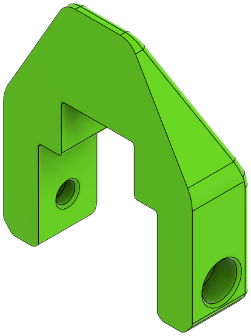

This page contains a bill of materials for each EVA "module".

!!! note
    - All heat set inserts are "Voron-style" (M3x5x4) instead of the thinner "EVA-style" (M3x4.6x4).

## Core EVA Parts

The Core EVA parts into are divided into logical submodules:

- [Universal Front](#universal-front)
- [Top Piece (with Endstop)](#top-piece-with-endstop)
- [Bottom Horns](#bottom-horns)
- [Cooling Inlet](#cooling-inlet)

There is no longer a back piece; it is removed in this mod. The part cooling inlet is modified to serve in its place.

### Universal Front

There are two version of the universal front:

1. `universal_front_fi.stl`: M1 modified stock front
2. `universal_front_pis_fi.stl`: Standard ADXL345 mount is replaced by a mount for the FYSETC portable input shaper.

=== "**1** `universal_front_fi.stl`"
    

    

    
    | Parts     | Qty | Notes |
    |-----------|-----|-------|
    | [:material-printer-3d-nozzle: `universal_front_fi.stl`][front]  | 1 | |
    | [:material-printer-3d-nozzle: `belt_grabber.stl`][belt_grabber] | 2 | |
    | Screw, M3-0.5 x 6mm       | 4 | May substitute with 8mm. |
    | Screw, M3-0.5 x 40mm      | 4 | |
    | Heat Set Insert, M3x5x4   | 14 |

    If using an accelerometer, add:

    - ADXL345 (x1)
    - Screw, M3-0.5 x 8mm (x2)

    

    

    { width=256px}
    

    

=== "**2** `universal_front_pis_fi.stl`"
    

    

    | Parts     | Qty | Notes |
    |-----------|-----|-------|
    | [:material-printer-3d-nozzle: `universal_front_pis_fi.stl`][front_pis]  | 1 | |
    | [:material-printer-3d-nozzle: `belt_grabber.stl`][belt_grabber] | 2 | |
    | Screw, M3-0.5 x 6mm       | 4 | May substitute with 8mm. |
    | Screw, M3-0.5 x 8mm       | 2 | |
    | Heat Set Insert, M3x5x4   | 16 |
    | FYSETC Portable Input Shaper | 1 |

    

    

    { width=256px}
    

    

### Top Piece with Endstop

1. `top_endstop_mgn12h.stl`: Top piece modified for M1 with a cable guide.
2. `top_endstop_mgn12h_pcb.stl`: Top piece for PCB mount users without a cable guide. See [PCB Mount](#pcb-mount).

=== "**1** `top_endstop_mgn12h.stl`"
    

    

    | Parts     | Qty | Notes |
    |-----------|-----|-------|
    | [:material-printer-3d-nozzle: `top_endstop_mgn12h.stl`][top] | 1 | |
    | [:material-printer-3d-nozzle: `cable_guide.stl`][cable_guide] | 1 | |
    | Horizontal limit switch  | 1 | |
    | Screw, M3-0.5 x 6mm      | 2 | May substitute 8mm. |
    | Screw, M3-0.5 x 8mm      | 6 | |
    | Heat Set Insert, M3x5x4  | 6 | |

    

    

    { width=256px}
    

    

=== "**2** `top_endstop_mgn12h_pcb.stl`"
    

    

    | Parts     | Qty | Notes |
    |-----------|-----|-------|
    | [:material-printer-3d-nozzle: `top_endstop_mgn12h_pcb.stl`][top_pcb] | 1 | |
    | Horizontal limit switch  | 1 | |
    | Screw, M3-0.5 x 8mm      | 6 | |
    | Heat Set Insert, M3x5x4  | 4 | |

    

    

    { width=256px}
    

    

### Bottom Horns

Two versions are available:

1. `bottom_horns_fi.stl`: Modified version of the stock bottom horns.
2. `bottom_horns_klicky_fi.stl`: Like the above, but with support for Klicky.

=== "**1** `bottom_horns_fi.stl`"
    

    

    | Parts     | Qty | Notes |
    |-----------|-----|-------|
    | [:material-printer-3d-nozzle: `bottom_horns_fi.stl`][bottom_horns]     | 1 | |
    | Heat Set Insert, M3x5x4   | 1 | |

    

    

    { width=256px}
    

    

=== "**2** `bottom_horns_klicky_fi.stl`"
    

    

    | Parts     | Qty | Notes |
    |-----------|-----|-------|
    | [:material-printer-3d-nozzle: `bottom_horns_klicky_fi.stl`][bottom_klicky]     | 1 | |
    | Heat Set Insert, M3x5x4   | 1 | |

    !!! note
        The additional materials required for the Klicky probe wiring and magnets are beyond the scope of this documentation.

    

    

    <!-- { width=256px} -->
    

    

### Cooling Inlet

Two versions are available:

1. `5015_inlet_fi.stl`: Modified stock 5015 inlet with lower height
2. `5015_sideways_inlet_fi.stl`: Low-height sideways mount for a 5015 part fan.

=== "**1** `5015_inlet_fi.stl`"
    

    

    | Parts     | Qty | Notes |
    |-----------|-----|-------|
    | [:material-printer-3d-nozzle: `5015_inlet_fi.stl`][5015_inlet] | 1 | |
    | Screw, M3-0.5 x 6mm       | 1 | May substitue 8mm. |
    | Screw, M3-0.5 x 20mm      | 1 | |
    | Screw, M3-0.5 x 45mm      | 4 | |
    | Heat Set Insert, M3x5x4   | 1 | |

    

    

    { width=256px}
    

    

=== "**2** `5015_sideways_inlet_fi.stl`"
    

    

    | Parts     | Qty | Notes |
    |-----------|-----|-------|
    | [:material-printer-3d-nozzle: `5015_sideways_inlet_fi.stl`][5015_sideways_inlet] | 1 | |
    | Screw, M3-0.5 x 6mm       | 1 | May substitue 8mm. |
    | Screw, M3-0.5 x 20mm      | 1 | |
    | Screw, M3-0.5 x 45mm      | 4 | |
    | Heat Set Insert, M3x5x4   | 1 | |

    

    

    { width=256px}
    

    

## Other EVA Parts

### BLTouch Mount

This part uses a built-in breakaway support. It may be safely removed.

| Parts     | Qty | Notes |
|-----------|-----|-------|
| [:material-printer-3d-nozzle: `bl_touch_mount.stl`][bltouch_mount] | 1 | |
| Hex Nut, M3               | 2 | |
| Screw, M3-0.5 x 6mm       | 2 | May substitute 8mm. |
| Screw, M3-0.5 x 8mm       | 2 | |

{ width=100px }

### Fan and Shroud

All stock shrouds are compatible with EVA34M1. 40mm cooling fans of both 10mm and 20mm thickness remain compatible.

Fans may be attached using an intake duct that allows two (2) screws to remove the fan instead of four (4). The BOM below is for a 4010 fan with and without the duct.

=== "With Intake Duct"
    

    

    | Parts     | Qty | Notes |
    |-----------|-----|-------|
    | [:material-printer-3d-nozzle: `front_intake_duct.stl`][front_intake]  | 1 | |
    | :material-printer-3d-nozzle: EVA shroud                | 1 | Your choice of printed shroud. Optional. |
    | Axial Fan, 40mm x 10mm    | 1 | May substitute 20mm thickness. |
    | Screw, M3-0.5 x 12mm      | 2 | |
    | Screw, M3-0.5 x 16mm      | 2 | |
    | Heat Set Insert, M3x5x4   | 2 | |

    

    

    { width=256px }
    

    

=== "Without Intake Duct"
    | Parts     | Qty | Notes |
    |-----------|-----|-------|
    | :material-printer-3d-nozzle: EVA shroud                | 1 | Your choice of printed shroud. Optional. |
    | Axial Fan, 40mm x 10mm    | 1 | May substitute 20mm thickness. |
    | Screw, M3-0.5 x 12mm      | 4 | |

### Hotend Mount: Dragon/Red Lizard BMO

This is a adaptation of [this mod](https://www.printables.com/model/200853-eva3-dragon-hotend-mount-insert) to use M3x5x4 inserts. No other changes are made.

| Part | Qty | Notes |
|------|-----|------|
| [:material-printer-3d-nozzle: `hotend_bmo_fi.stl`][dragon_bmo] | 1 | |
| Dragon BMO hotend         | 1 | |
| Screw, M2.5 x 8mm SHCS    | 4 | Usually comes with the hotend. |
| Screw, M3-0.5 x 8mm SHCS  | 4 | |
| Heat Set Insert, M3x5x4   | 8 | |

## New Parts

### PCB Mount

Mounts for both '36 and '42 PCBs are available. Examples of '36 PCBs are the BIGTREETECH EBB36 and Piggyback36, as well as the Mellow Fly SHT36. An example of a '42 PCB is the BIGTREETECH EBB42.

Other than the printed part, the materials for these are identical.

!!! caution
    These mounts are only currently tested on NEMA17 steppers.

=== "'36 PCB"
    

    

    | Parts     | Qty | Notes |
    |-----------|-----|-------|
    | [:material-printer-3d-nozzle: `pcb36_mount.stl`][pcb36_mount] | 1 | |
    | [:material-printer-3d-nozzle: `cable_guide.stl`][cable_guide] | 1 | |
    | Toolhead PCB      | 1 | |
    | Screw, M3-0.5 x 25mm | 2 | |
    | Screw, M3-0.5 x 6mm  | 4 | May substitute two (2) 8mm screws, if desired. |

    

    

    { width=200px }
    

    

=== "'42 PCB"
    

    

    | Parts     | Qty | Notes |
    |-----------|-----|-------|
    | [:material-printer-3d-nozzle: `pcb42_mount.stl`][pcb42_mount] | 1 | |
    | [:material-printer-3d-nozzle: `cable_guide.stl`][cable_guide] | 1 | |
    | Toolhead PCB      | 1 | |
    | Screw, M3-0.5 x 25mm | 2 | |
    | Screw, M3-0.5 x 6mm  | 4 | May substitute two (2) 8mm screws, if desired. |

    

    

    { width=200px }
    

    

### Z End Stop Mount

This part is necessary for Ender 5 Pros with stock (non-Hydra) Z kinematics. This part mounts the limit switch higher than normal.

| Parts     | Qty | Notes |
|-----------|-----|-------|
| [:material-printer-3d-nozzle: `z_limit_switch_cover.stl`][z_limit_cover] | 1 | |
| [:material-printer-3d-nozzle: `z_limit_switch_mount.stl`][z_limit_cover] | 1 | |
| Screw, M3-0.5 x 16mm | 2 | |
| Screw, M5-0.8 x 8mm  | 1 | |
| Tee Nut, Drop In, M5 | 1 | |
| Heat Set Insert, M3x5x4 | 2 |

{ width=256px }

### X Axis Stop Block

This is an adaptation of the M1 stop block for EVA 3.

| Parts     | Qty | Notes |
|-----------|-----|-------|
| [:material-printer-3d-nozzle: `x_axis_stop_block.stl`][x_stop_block] | 1 | |
| Screw, M3-0.5 x 8mm | 2 | |
| Tee Nut, Drop In, M3 | 2 | Roll in tee nuts may be used for easier installation. |

{ width=200px }

