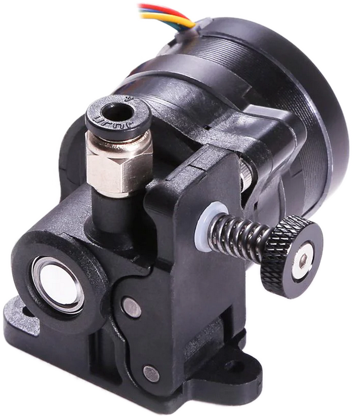
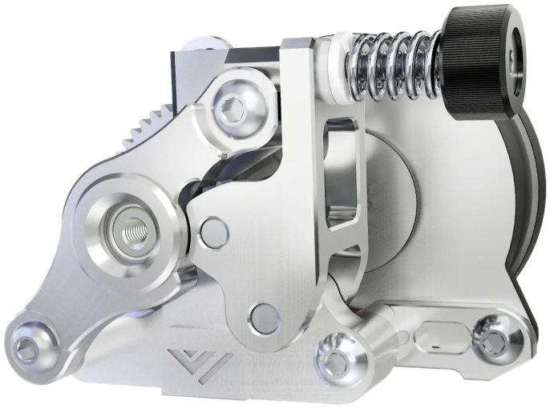

This pages list extruders (called Drives in EVA 3) known to have mounts. Any drive mount designed for EVA 3 should be compatible with E34M1.

<!-- 
Template:

- **Author**: [Name]()
- **Inserts/Hex Nuts**: Insert type and/or hex nuts

[Inserts Link](){.md-button}
[Hex Nuts Link](){.md-button}

{width="200px"}

 -->

## E34M1 Drives

These are EVA 3 Drive mounts modified in one of several ways from stock EVA:

- They are converted to better accept Voron-style inserts (where applicable),
- Most mounts are lighter,
- Free overhangs are improved, and
- There is room for lock washers on all fasteners.

### [Annex Sherpa Mini](../modules/drive.md#annex-sherpa-mini)

<figure markdown>
[{width="200px"}](../modules/drive.md#annex-sherpa-mini)
</figure>

### [Bondtech BMG](../modules/drive.md#bondtech-bmg)

<figure markdown>
[{width="200px"}](../modules/drive.md#bondtech-bmg)
</figure>

### [Bondtech LGX](../modules/drive.md#bondtech-lgx)

<figure markdown>
[{width="200px"}](../modules/drive.md#bondtech-lgx)
</figure>

### [Bondtech LGX Lite](../modules/drive.md#bondtech-lgx-lite)

<figure markdown>
[{width="200px"}](../modules/drive.md#bondtech-lgx-lite)
</figure>

### [LDO Orbiter 1.5](../modules/drive.md#ldo-orbiter-15)

<figure markdown>
[{width="200px"}](../modules/drive.md#ldo-orbiter-15)
</figure>

### [LDO Orbiter 2.0](../modules/drive.md#ldo-orbiter-20)

<figure markdown>
[{width="200px"}](../modules/drive.md#ldo-orbiter-20)
</figure>

## EVA 3 Ecosystem Drives

These are mounts from the larger EVA ecosystem that link to external sites.

### Annex Sherpa Micro

- **Author**: [Psych0h3ad](https://www.printables.com/@Psych0h3ad_168275)
- **Inserts/Hex Nuts**: M3x4.6x4 inserts

[Link](https://www.printables.com/model/224597-sherpa-micro-mount-for-eva-3){ .md-button}

{width="200px"}

### E3D Titan

- **Author**: [Chana Kennington](https://www.printables.com/@ChanaKenningt_484474)
- **Inserts/Hex Nuts**: None

[Link](https://www.printables.com/model/424090-eva3-titan-extruder-mount){ .md-button }

{width="200px"}

### VzBoT3D Vz-HextrudORT Low

- **Author**: [Pr20100](https://www.printables.com/@Pr20100)
- **Inserts/Hex Nuts**: M3x4.6x4 inserts or hex nuts

[Link](https://www.printables.com/model/355751-eva-3-vz-hextrudort-low-extruder-mounting-plate){ .md-button }

{width="200px"}

