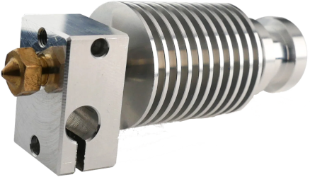
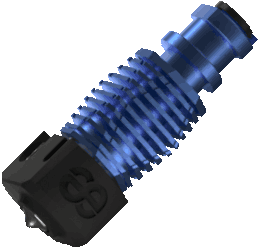

This pages list hotends known to have mounts for EVA 3. Any hotend mount for EVA 3 should be compatible with E34M1.

These are third-party links and may not contain a BOM.
<!-- 
Template:

- **Author**: [Name]()
- **Inserts/Hex Nuts**: Insert type and/or hex nuts

[Inserts Link](){.md-button}
[Hex Nuts Link](){.md-button}

{width="200px"}

 -->

## E3D 

### Revo Micro

- **Author**: [hebijirik](https://www.printables.com/@hebijirik_84624) (hex nuts)
- **Inserts/Hex Nuts**: hex nuts

<!-- [Inserts Link](https://www.printables.com/model/241941-eva-3-revo-micro-heat-set-insert){.md-button} -->
[Hex Nuts Link](https://www.printables.com/model/225581-eva-3-revo-micro-hotend/files){.md-button}

{width="200px"}

### Revo Voron

- **Author**: EVA
- **Inserts/Hex Nuts**: M3x4.6x4 inserts or hex nuts

[Inserts Link with BOM](https://main.eva-3d.page/heat_insert/hotend/revo_voron/){.md-button}
[Hex Nuts Link with BOM](https://main.eva-3d.page/hex_nuts/hotend/revo_voron/){.md-button}

{width="200px"}

### V6 & Revo V6

- **Author**: [3DP-MAMSIH](https://www.printables.com/@3DPMAMSIH)
- **Inserts/Hex Nuts**: M3x4.6x4 inserts or hex nuts

[Link](https://www.printables.com/model/201093-eva-30-e3dv6-revo-revo-micro-hotends-mount){.md-button}

{width="200px"}

## Phaetus

### Dragonfly BMO

- **Author**: EVA
- **Inserts/Hex Nuts**: M3x4.6x4 inserts or hex nuts

[Inserts Link with BOM](https://main.eva-3d.page/heat_insert/hotend/bmo/){.md-button}
[Hex Nuts Link with BOM](https://main.eva-3d.page/hex_nuts/hotend/bmo/){.md-button}

### Dragonfly BMS

!!! note
    This part is only compatible with 6-fin heatsink.

- **Author**: [themacboy](https://www.printables.com/@themacboy_276431)
- **Inserts/Hex Nuts**: M3x4.6x4 inserts or hex nuts

[Link](https://www.printables.com/model/249767-phaetus-dragonfly-bms-for-eva-v3-carriage){.md-button}

### Dragon SF/HF

- **Author**: [jonspaceharper](https://www.printables.com/@jonspaceharper)
- **Inserts/Hex Nuts**: M3x5x4 inserts

[Link with BOM](https://www.printables.com/model/436000-e34m1eva-3-dragon-hotend-mount){.md-button}

### Rapido

- **Author**: EVA
- **Inserts/Hex Nuts**: M3x4.6x4 inserts or hex nuts

[Insert Link with BOM](https://main.eva-3d.page/heat_insert/hotend/rapido/){.md-button}
[Hex Nut Link with BOM](https://main.eva-3d.page/hex_nuts/hotend/rapido/){.md-button}

{width="200px"}

## Other Hotends

### 3D Passion Nova

- **Author**: EVA
- **Inserts/Hex Nuts**: M3x4.6x4 inserts or hex nuts

[Inserts Link with BOM](https://main.eva-3d.page/heat_insert/hotend/nova/){ .md-button }
[Hex Nuts Link with BOM](https://main.eva-3d.page/hex_nuts/hotend/nova/){ .md-button }

{width="200px"}

### Slice Engineering Mosquito

- **Author**: EVA
- **Inserts/Hex Nuts**: M3x4.6x4 inserts or hex nuts

[Insert Link with BOM](https://main.eva-3d.page/heat_insert/hotend/mosquito/){.md-button}
[Hex Nut Link with BOM](https://main.eva-3d.page/hex_nuts/hotend/mosquito/){.md-button}

{width="200px"}

