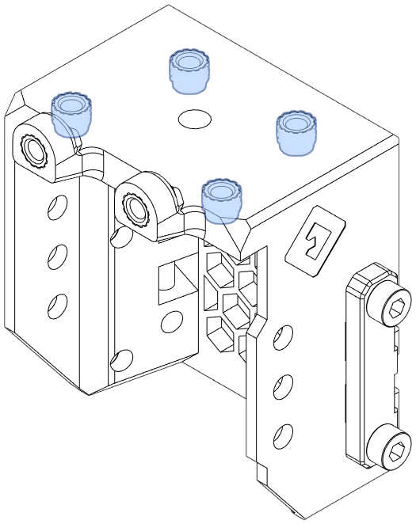

This page demonstrates the location of every heat set insert in E34M1.

!!! note
    All heat set inserts are "Voron-style" (M3x5x4) instead of the thinner "EVA-style" (M3x4.6x4).

    Any stock parts that require inserts may still require the use of EVA-style inserts.

## Standard EVA Parts

### Universal Front

{width=300}

{width=300}

{width=300}

**`universal_front_pis_fi.stl`** has two additional inserts:

{width=300}

### Top Piece with Endstop

!!! warning "Caution"
    The four HSIs for for the drive module should be inserted from the bottom, not the top.

**`top_endstop_mgn12h.stl`**

{ width=200px}

**`top_endstop_mgn12h_pcb.stl`**

{ width=200px}

### Bottom Horns

**`bottom_horns_fi.stl`**

{ width=256px}

### Cooling Inlet

**`5015_inlet_fi.stl`**

{ width=256px}

**`5015_sideways_inlet_fi.stl`**

{ width=256px}

## Other Parts

### Front Cooling Intake

**`front_intake_duct.stl`**

{width=200px}

### PCB Mount

**`pcb36_mount.stl`**

{ width=256px}

**`pcb42_mount.stl`**

{ width=200px}

**`pcb36_mount_cable_chain.stl`**

{ width=200px}

**`pcb42_mount_cable_chain.stl`**

{ width=200px}

### Z End Stop Mount

**`z_limit_switch_mount.stl`**

{ width=256px }

[x_stop_block]: https://github.com/jon-harper/MercuryOneUserMods/blob/EVA3/Mercury_One/jonspaceharper/EVA3/STL/x_axis_stop_block.stl
[z_limit_cover]: https://github.com/jon-harper/MercuryOneUserMods/blob/EVA3/Mercury_One/jonspaceharper/EVA3/STL/z_limit_switch_cover.stl
[z_limit_mount]: https://github.com/jon-harper/MercuryOneUserMods/blob/EVA3/Mercury_One/jonspaceharper/EVA3/STL/z_limit_switch_mount.stl
[cable_guide]: https://github.com/jon-harper/MercuryOneUserMods/blob/EVA3/Mercury_One/jonspaceharper/EVA3/STL/cable_guide.stl
[pcb36_mount]: https://github.com/jon-harper/MercuryOneUserMods/blob/EVA3/Mercury_One/jonspaceharper/EVA3/STL/pcb36_mount.stl
[pcb42_mount]: https://github.com/jon-harper/MercuryOneUserMods/blob/EVA3/Mercury_One/jonspaceharper/EVA3/STL/pcb42_mount.stl
[front_intake]: https://github.com/jon-harper/MercuryOneUserMods/blob/EVA3/Mercury_One/jonspaceharper/EVA3/STL/front_intake_duct.stl
[bottom_horns]: https://github.com/jon-harper/MercuryOneUserMods/blob/EVA3/Mercury_One/jonspaceharper/EVA3/STL/bottom_horns_fi.stl
[belt_grabber]: https://github.com/jon-harper/MercuryOneUserMods/blob/EVA3/Mercury_One/jonspaceharper/EVA3/STL/belt_grabber.stl
[bltouch_mount]: https://github.com/jon-harper/MercuryOneUserMods/blob/EVA3/Mercury_One/jonspaceharper/EVA3/STL/bl_touch_mount.stl
[5015_inlet]: https://github.com/jon-harper/MercuryOneUserMods/blob/EVA3/Mercury_One/jonspaceharper/EVA3/STL/5015_inlet_fi.stl
[5015_sideways_inlet]: https://github.com/jon-harper/MercuryOneUserMods/blob/EVA3/Mercury_One/jonspaceharper/EVA3/STL/5015_sideways_inlet_fi.stl
[front]: https://github.com/jon-harper/MercuryOneUserMods/blob/EVA3/Mercury_One/jonspaceharper/EVA3/STL/front_universal_fi.stl
[front_pis]: https://github.com/jon-harper/MercuryOneUserMods/blob/EVA3/Mercury_One/jonspaceharper/EVA3/STL/front_universal_pis_fi.stl
[top]: https://github.com/jon-harper/MercuryOneUserMods/blob/EVA3/Mercury_One/jonspaceharper/EVA3/STL/top_endstop_mgn12h.stl
[top_pcb]: https://github.com/jon-harper/MercuryOneUserMods/blob/EVA3/Mercury_One/jonspaceharper/EVA3/STL/top_endstop_mgn12h_pcb.stl