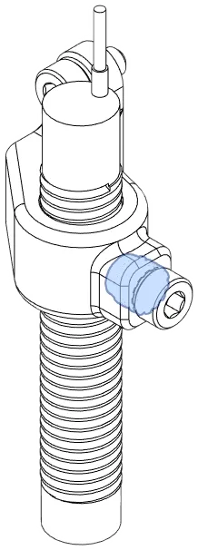
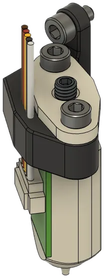
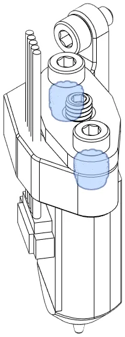
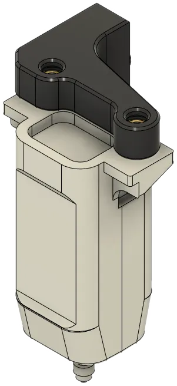
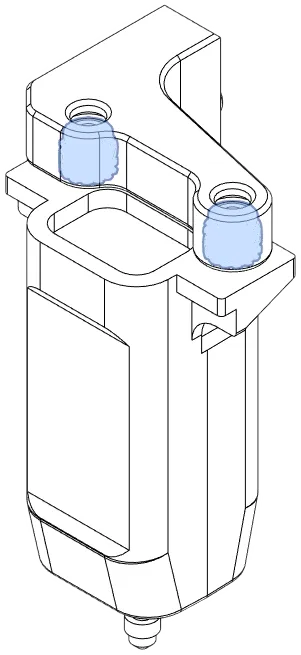
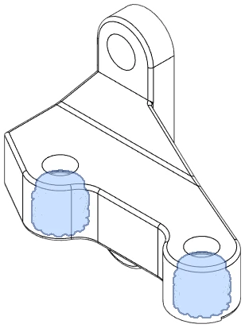

The side mount is used by many ABL methods and attaches to the Front. If you use Klicky or Beacon, see the [Bottom Horns](bottom.md) module for mounting options.

These ABL and hotend length combinations are available:

- [8mm Inductive Probe](#8mm-inductive-probe)
- [BLTouch](#bltouch)
- [BLTouch UHF](#bltouch-uhf)
- [CR Touch](#cr-touch)
- [CR Touch UHF](#cr-touch-uhf)

### 8mm Inductive Probe

**Description:** Mounts an 8mm inductive probe, such the Prusa Research SuperPINDA.

[**Revision:**](#revision-history) v0.4

| Parts     | Qty |
|-----------|-----|
| [:material-printer-3d-nozzle: `abl_8mm_probe.stl`][abl_8mm_probe] | 1 |
| 8mm Inductive Probe       | 1 |
| Heat Set Insert, M3x5x4   | 2 |
| M3-0.5 x 6mm SHCS         | 2 |
| M3-0.5 x 12mm SHCS        | 2 |

{ width=100px }

??? "Heat Set Insert Locations"
    {width="150px"}

### BLTouch

**Description**

Mounts a BLTouch.

[**Revision:**](#revision-history) v0.4

**Bill of Materials**

| Parts     | Qty |
|-----------|-----|
| [:material-printer-3d-nozzle: `abl_bl_touch.stl`][bltouch_mount] | 1 |
| BL-Touch or clone         | 1 |
| Heat Set Insert, M3x5x4   | 2 |
| M3-0.5 x 6mm SHCS         | 4 |

{ width=100px }

??? "Heat Set Insert Locations"
    {width="200px"}

### BLTouch UHF

**Description**

Adds support for BLTouch for longer hotends.

[**Revision:**](#revision-history) v0.4

**Bill of Materials**

| Parts     | Qty |
|-----------|-----|
| [:material-printer-3d-nozzle: `abl_bl_touch_uhf.stl`][bltouch_volcano] | 1 |
| BL-Touch or clone         | 1 |
| Hex Nut, M3               | 2 |
| M3-0.5 x 6mm SHCS         | 4 |

{ width=100px }

??? "Heat Set Insert Locations"
    {width="150px"}

### CR Touch

**Description:** Mounts a Creality CR Touch.

[**Revision:**](#revision-history) v0.4

| Parts     | Qty |
|-----------|-----|
| [:material-printer-3d-nozzle: `abl_cr_touch.stl`][crtouch_mount] | 1 |
| Creality CR-Touch         | 1 |
| Heat Set Insert, M3x5x4   | 2 |
| M3-0.5 x 6mm SHCS         | 2 |
| M3-0.5 x 12mm SHCS        | 2 |

{ width=100px }

??? "Heat Set Insert Locations"
    {width="150px"}

### CR Touch UHF

**Description:** Mounts a Creality CR Touch.

Legacy support for Volcano hotends is availabe through [Psych0h3ad](https://www.printables.com/@Psych0h3ad_168275)'s mod [CR Touch for Volcano Hotends](https://www.printables.com/model/434179-eva3-uhf-cr-touch).

[**Revision:**](#revision-history) v0.4

| Parts     | Qty |
|-----------|-----|
| [:material-printer-3d-nozzle: `abl_cr_touch_uhf.stl`][crtouch_volcano] | 1 |
| Creality CR-Touch         | 1 |
| Heat Set Insert, M3x5x4   | 2 |
| M3-0.5 x 6mm SHCS         | 2 |
| M3-0.5 x 12mm SHCS        | 2 |

{ width=100px }

??? "Heat Set Insert Locations"
    {width="150px"}

## Revision History

| Date | File | Version | Description |
|------|------|---------|-------------|
| 23/11/03  | `abl_bl_touch.stl`            | 0.4 | Renamed `bl_touch_mount.stl`; new template |
| 23/11/03  | `abl_bl_touch_uhf.stl`        | 0.4 | Renamed `bl_touch_volcano_mount.stl`; new template |
| 23/11/03  | `abl_cr_touch.stl`            | 0.4 | Renamed `cr_touch_mount.stl`; new template |
| 23/11/03  | `abl_cr_touch_uhf.stl`        | 0.4 | Added support based on new template. |
| 23/11/03  | `abl_8mm_probe.stl`           | 0.4 | Added support based on new template. |
| 23/04/27  | `bl_touch_mount.stl`          | 0.3 | Redesign. |
| 23/04/18  | `cr_touch_mount.stl`          | 0.1 | Initial commit. |
| 23/02/01  | `bl_touch_volcano_mount.stl`  | 0.1 | Initial commit. |
| 23/01/20  | `bl_touch_mount.stl`          | 0.1 | Inital commit.  |