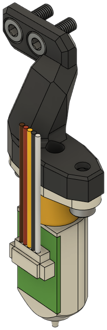

The side mount is used by most ABL methods and attaches to the Front. See the [Bottom Horns](bottom.md) module for Klicky and Beacon mounting options.

These ABL and hotend length combinations are available:

1. BLTouch for Standard Hotends
2. BLTouch for Volcano Hotends
<!-- 3. CR Touch for Standard Hotends -->

CR Touch Volcano Hotends support is available through [this mod](https://www.printables.com/model/434179-eva3-uhf-cr-touch).

### BLTouch for Standard Hotends

**Description**

Mounts a BLTouch.

**Bill of Materials**

| Parts     | Qty |
|-----------|-----|
| [:material-printer-3d-nozzle: `bl_touch_mount.stl`][bltouch_mount] | 1 |
| Hex Nut, M3               | 2 |
| Screw, M3-0.5 x 6mm       | 4 |

{ width=100px }

### BLTouch for Volcano Hotends

**Description**

Adds support for BLTouch for longer hotends.

**Bill of Materials**

| Parts     | Qty |
|-----------|-----|
| [:material-printer-3d-nozzle: `bl_touch_volcano_mount.stl`][bltouch_volcano] | 1 |
| Hex Nut, M3               | 2 |
| Screw, M3-0.5 x 6mm       | 4 |

<!-- { width=100px } -->

<!-- ### CR Touch

| Parts     | Qty | Notes |
|-----------|-----|-------|
| [:material-printer-3d-nozzle: `cr_touch_mount.stl`][crtouch_mount] | 1 | |
| Heat Set Insert, M3x5x4   | 2 | |
| Screw, M3-0.5 x 8mm       | 4 | |

{ width=100px }

 -->
