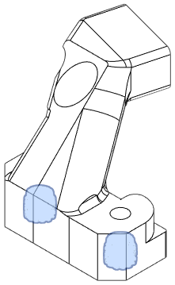

The side mount is used by most ABL methods and attaches to the Front. See the [Bottom Horns](bottom.md) module for Klicky and Beacon mounting options.

These ABL and hotend length combinations are available:

- BLTouch
- BLTouch (Volcano)
- CR Touch
- CR Touch (Volcano)

### BLTouch

**Description**

Mounts a BLTouch.

[**Revision:**](#revision-history) v0.3

**Bill of Materials**

| Parts     | Qty |
|-----------|-----|
| [:material-printer-3d-nozzle: `bl_touch_mount.stl`][bltouch_mount] | 1 |
| Heat Set Insert, M3x5x4   | 2 |
| M3-0.5 x 6mm SHCS         | 4 |

{ width=100px }

??? "Heat Set Insert Locations"
    {width="200px"}

### BLTouch (Volcano)

**Description**

Adds support for BLTouch for longer hotends.

[**Revision:**](#revision-history) v0.1

**Bill of Materials**

| Parts     | Qty |
|-----------|-----|
| [:material-printer-3d-nozzle: `bl_touch_volcano_mount.stl`][bltouch_volcano] | 1 |
| Hex Nut, M3               | 2 |
| M3-0.5 x 6mm SHCS         | 4 |

{ width=100px }

### CR Touch

!!! tip "Fit test pending ([Issue #1](https://github.com/jon-harper/E34M1/issues/1))"

**Description:** Mounts a Creality CR Touch.

[**Revision:**](#revision-history) v0.1

| Parts     | Qty |
|-----------|-----|
| [:material-printer-3d-nozzle: `cr_touch_mount.stl`][crtouch_mount] | 1 |
| Heat Set Insert, M3x5x4   | 2 |
| M3-0.5 x 6mm SHCS         | 2 |
| M3-0.5 x 12mm SHCS        | 2 |

{ width=100px }

??? "Heat Set Insert Locations"
    {width="150px"}

### CR Touch (Volcano)

Support for Volcano hotends is availabe through [Psych0h3ad](https://www.printables.com/@Psych0h3ad_168275)'s mod [CR Touch for Volcano Hotends](https://www.printables.com/model/434179-eva3-uhf-cr-touch).

## Revision History

| Date | File | Version | Description |
|------|------|---------|-------------|
| 23/04/27  | `bl_touch_mount.stl`          | 0.3 | Redesign. |
| 23/04/18  | `cr_touch_mount.stl`          | 0.1 | Initial commit. |
| 23/02/01  | `bl_touch_volcano_mount.stl`  | 0.1 | Initial commit. |
| 23/01/20  | `bl_touch_mount.stl`          | 0.1 | Inital commit.  |