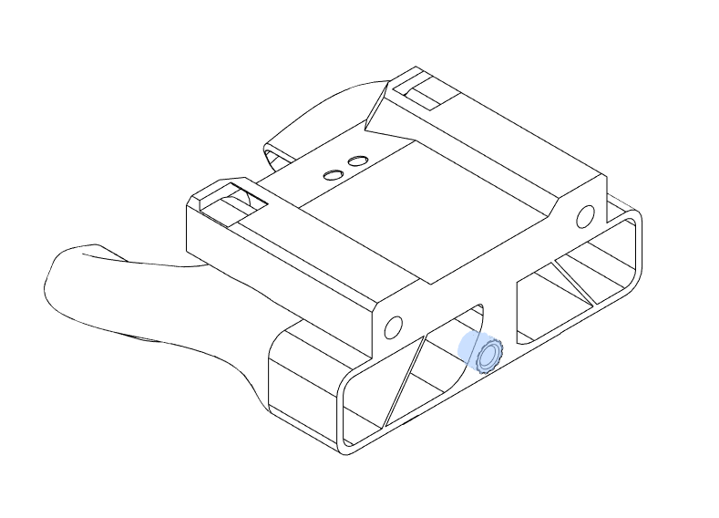
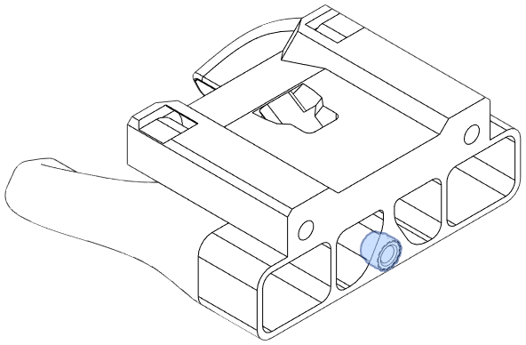
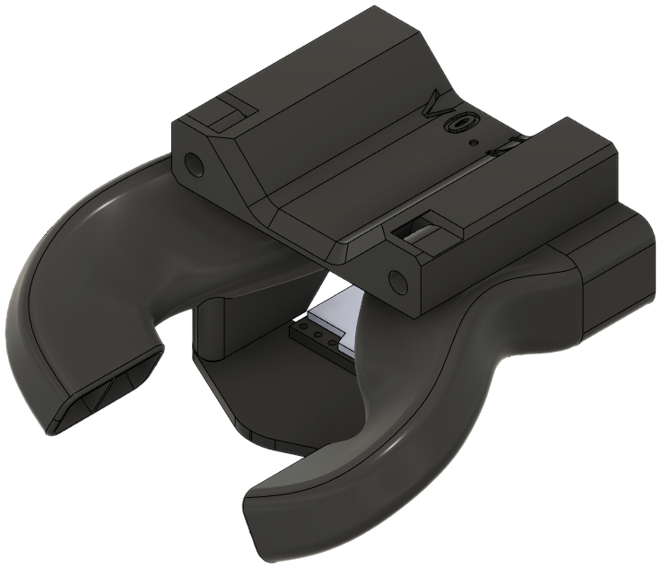

Several versions of the bottom horns are available for E34M1. Which version you should use depends on your hotend and your ABL method. See the [Compatibility](../compat/index.md#bottom-horns) page for a breakdown table.

This page is divided into two sections for standard-length hotends and Volcano/UHF hotends.

## Standard Hotend Bottom Horns

### Dual Horns

**Description**

This is a modified version of the stock EVA dual horns.

[**Revision:**](#revision-history) v0.1

**Bill of Materials**

| Parts     | Qty |
|-----------|-----|
| [:material-printer-3d-nozzle: `stock_bottom.stl`][bottom_horns]     | 1 |
| Heat Set Insert, M3x5x4   | 1 |

{ width=256px}

??? info "Heat Set Insert Locations"
    { width=256px}

### Dual Horns for Beacon

**Description**

!!! info "Designed by [cuiviemen](https://www.printables.com/@cuiviemen_127292)"

!!! tip "This part requires the matching [Sideways Cooling Inlet for Beacon](rear.md#sideways-cooling-inlet-for-beacon)"

**Description**

A version of the dual horns that mounts a Beacon probe, with a cutout for the 4-pin Sherlock connector. The Beacon kit should include the M3 screws needed to attach the Beacon PCB.

The Y offset of the Beacon probe is 34mm.

[**Revision:**](#revision-history) v0.1

**Origin**: [Beacon 3D mount solution for E34M1 - EVA 3 for Mercury One](https://www.printables.com/model/438193-beacon-3d-mount-solution-for-e34m1-eva-3-for-mercu) by [cuiviemen](https://www.printables.com/@cuiviemen_127292)

**Bill of Materials**

| Parts     | Qty |
|-----------|-----|
| [:material-printer-3d-nozzle: `beacon_bottom.stl`][bottom_beacon]     | 1 | 
| Heat Set Insert, M3x5x4   | 3 |
| Low-Profile Beacon Kit    | 1 |

{ width=256px}

??? info "Heat Set Insert Locations"
    { width=256px}

### Dual Horns for Klicky

**Description**

A version of the dual horns for Klicky users, with cutouts for magnets and wiring.

The Klicky probe's Y offset is approximately 37mm from the nozzle.

[**Revision:**](#revision-history) v0.2

**Bill of Materials**

| Parts     | Qty |
|-----------|-----|
| [:material-printer-3d-nozzle: `klicky_bottom.stl`][bottom_klicky]     | 1 |
| Heat Set Insert, M3x5x4   | 1 |
| 24 awg hookup wire (1.5mm^2^) | 1ft/30cm |
| 6mm x 3mm magnets         | 3 |

{ width=256px}

??? info "Heat Set Insert Locations"
    { width=256px}

### Trihorns

**Description**

Three-horned duct adopted from stock EVA, recommended for the Mosquito hotend.

[**Revision:**](#revision-history) v0.1

**Bill of Materials**

| Parts     | Qty |
|-----------|-----|
| [:material-printer-3d-nozzle: `stock_bottom_trihorn.stl`][bottom_trihorns]     | 1 |
| Heat Set Insert, M3x5x4   | 1 |

{ width=256px}

??? info "Heat Set Insert Locations"
    { width=256px}

### Trihorns for Beacon

!!! info "Designed by [cuiviemen](https://www.printables.com/@cuiviemen_127292)"

!!! tip "This part requires the matching [Sideways Cooling Inlet for Beacon](rear.md#sideways-cooling-inlet-for-beacon)"

**Description**

A version of the dual horns that mounts a Beacon probe, with a cutout for the 4-pin Sherlock connector. The Beacon kit should include the M3 screws needed to attach the Beacon PCB.

The Y offset of the Beacon probe is 34mm.

[**Revision:**](#revision-history) v0.1

**Origin**: [Beacon 3D mount solution for E34M1 - EVA 3 for Mercury One](https://www.printables.com/model/438193-beacon-3d-mount-solution-for-e34m1-eva-3-for-mercu) by [cuiviemen](https://www.printables.com/@cuiviemen_127292)

**Bill of Materials**

| Parts     | Qty |
|-----------|-----|
| [:material-printer-3d-nozzle: `beacon_bottom.stl`][bottom_beacon_trihorn]     | 1 | 
| Heat Set Insert, M3x5x4   | 3 |
| Low-Profile Beacon Kit    | 1 |

{ width=256px}

??? info "Heat Set Insert Locations"
    { width=256px}

### Trihorns for Klicky

**Description**

A version of the trihorns for Klicky, with cutouts for magnets and wiring.

The Klicky probe's Y offset is approximately 37mm from the nozzle.

[**Revision:**](#revision-history) v0.1

**Bill of Materials**

| Parts     | Qty |
|-----------|-----|
| [:material-printer-3d-nozzle: `klicky_bottom_trihorn.stl`][bottom_klicky_trihorn]     | 1 |
| Heat Set Insert, M3x5x4   | 1 |
| 24 awg hookup wire (1.5mm^2^) | 1ft/30cm |
| 6mm x 3mm magnets         | 3 |

{ width=256px}

??? info "Heat Set Insert Locations"
    { width=256px}

## Volcano/UHF Bottom Horns

Volcano bottom horn support is limited. The EVA 3 source file contains gemeotry errors and must be modified as a mesh.

### Dual Horns for Beacon

!!! info "Designed by [Psych0h3ad](https://www.printables.com/@Psych0h3ad_168275)"

**Description**

These bottom horns have a mount for a Beacon PCB. The Beacon kit should include low-profile M3 screws to attach the PCB.

The probe Y offset is 17mm.

Two options are available for routing the rear wiring:

- [cuiviemen](https://www.printables.com/@cuiviemen_127292)'s [Beacon mod](https://www.printables.com/model/438193-beacon-3d-mount-solution-for-e34m1-eva-3-for-mercu) passes the USB cable between the rear intake and 5015 fan.
- The [Sideways Cooling Inlet for Beacon](rear.md#sideways-cooling-inlet-for-beacon) routes the wire outside the cooling inlet.

[**Revision:**](#revision-history) v0.1

**Origin**

[EVA3.0 Phaetus Rapido UHF/Volcano +Beacon for Mercury One.1 by ZERO G](https://www.printables.com/model/428524-eva30-phaetus-rapido-uhfvolcano-beacon-for-mercury) by [Psych0h3ad](https://www.printables.com/@Psych0h3ad_168275)

**Bill of Materials**

| Parts     | Qty |
|-----------|-----|
| [:material-printer-3d-nozzle: `beacon_bottom_uhf.stl`][bottom_beacon_uhf]     | 1 |
| Heat Set Insert, M3x5x4   | 3 |
| Low-Profile Beacon Kit    | 1 |

{ width=256px}

??? info "Heat Set Insert Locations"
    { width=256px}

### Dual Horns for Klicky

!!! tip "Fit Test Pending: See [Issue #12](https://github.com/jon-harper/E34M1/issues/12)"

**Description**

These horns have points for embedding magnets and holes to route the wiring for Klicky.

The Klicky probe's Y offset is approximately 37mm from the nozzle.

[**Revision:**](#revision-history) v0.1

**Bill of Materials**

| Parts     | Qty |
|-----------|-----|
| [:material-printer-3d-nozzle: `beacon_bottom_uhf.stl`][bottom_klicky_uhf]     | 1 |
| Heat Set Insert, M3x5x4   | 3 |
| 24 awg hookup wire (1.5mm^2^) | 1ft/30cm |
| 6mm x 3mm magnets         | 3 |

{ width=256px}

??? info "Heat Set Insert Locations"
    { width=256px}

## Revision History

| Date | File | Version | Description |
|------|------|---------|-------------|
| 23/09/03 | `klicky_bottom.stl`            | v0.2 | Fixed wiring issues. |
| 23/08/16 | `klicky_bottom_trihorn.stl`    | v0.2 | Fixed wiring issues. |
| 23/04/18 | `beacon_bottom.stl`            | v0.1 | Initial release. |
| 23/04/18 | `beacon_bottom_no_hsi.stl`     | v0.1 | Initial release. |
| 23/04/18 | `beacon_bottom_trihorns.stl`   | v0.1 | Initial release. |
| 23/04/04 | `beacon_bottom_uhf.stl`        | v0.1 | Initial commit. |
| 23/02/01 | `klicky_bottom.stl`            | v0.1 | Initial commit. |
| 23/04/04 | `klicky_bottom_trihorn.stl`    | v0.1 | Initial commit. |
| 23/01/10 | `stock_bottom.stl`             | v0.1 | Initial commit. |
| 23/04/04 | `stock_bottom_trihorn.stl`     | v0.1 | Initial commit. |