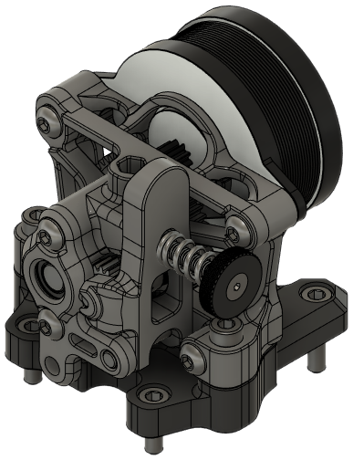
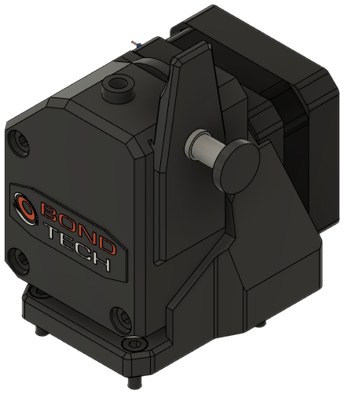
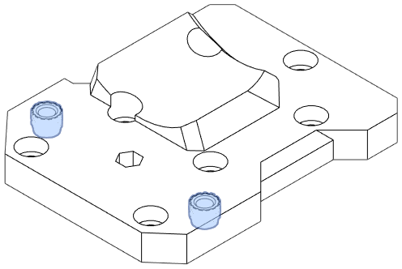

!!! tip
    See **[Extruder Compatibility](../compat/drives.md)** for a larger list that includes compatible third party mounts.

<!-- Template

**Origin**: EVA

**Bill of Materials**

| Parts     | Qty |
|-----------|-----|
| [:material-printer-3d-nozzle: `drive_.stl`][]  | 1 |

{ width=256px}

-->

## Annex Sherpa Mini

**Origin**: EVA

**Bill of Materials**

| Parts     | Qty |
|-----------|-----|
| [:material-printer-3d-nozzle: `drive_sherpa_mini.stl`][drive_sherpa_mini]  | 1 |
| NEMA14 stepper            | 1 |
| Assembled Sherpa Mini     | 1 |
| M3-0.5 x 8mm SHCS         | 4 |
| M3-0.5 x 12mm SHCS        | 6 |
| *Lock washer, M3*         | 7 |

This extruder needs 14mm of PTFE.

{ width=256px}

## Bondtech BMG

**Origin**: EVA

**Bill of Materials**

| Parts     | Qty |
|-----------|-----|
| [:material-printer-3d-nozzle: `drive_bmg.stl`][drive_bmg]  | 1 |
| NEMA17 stepper            | 1 |
| Bondtech BMG              | 1 |
| M3-0.5 x 8mm SHCS         | 4 |
| M3-0.5 x 12mm SHCS        | 3 |
| M3-0.5 x 35mm SHCS        | 3 |
| *Lock washer, M3*         | 7 |

This extruder needs 28.9mm of PTFE.

{ width=256px}

## Bondtech LGX

!!! tip "Fit test pending ([Issue #5](https://github.com/jon-harper/E34M1/issues/5))"
    [Click here](https://main.eva-3d.page/heat_insert/drive/lgx/) for the tested, stock file from EVA instead.

**Origin**: EVA

**Bill of Materials**

| Parts     | Qty |
|-----------|-----|
| [:material-printer-3d-nozzle: `drive_lgx.stl`][drive_lgx]  | 1 |
| NEMA17 stepper            | 1 |
| Bondtech LGX with Copperhead mount | 1 |
| M3-0.5 x 8mm SHCS         | 6 |
| M3-0.5 x 12mm SHCS        | 4 |
| *Lock washer, M3*         | 10 |

This extruder needs 20.8mm of PTFE.

{ width=256px}

## Bondtech LGX Lite

**Origin**: EVA

**Bill of Materials**

| Parts     | Qty |
|-----------|-----|
| [:material-printer-3d-nozzle: `drive_lgx_lite.stl`][drive_lgx_lite]  | 1 |
| NEMA14 stepper        | 1 |
| Bondtech LGX Lite     | 1 |
| M3-0.5 x 6mm SHCS     | 3 |
| M3-0.5 x 8mm SHCS     | 2 |
| M3-0.5 x 12mm SHCS    | 4 |
| *Lock washer, M3*     | 9 |

This extruder needs 14.2mm of PTFE.

{ width=256px}

## LDO Orbiter 1.5

!!! tip "Fit test pending ([Issue #5](https://github.com/jon-harper/E34M1/issues/5))"
    [Click here](https://main.eva-3d.page/heat_insert/drive/orbiter_1_5/) for the tested, stock file from EVA instead.

**Origin**: EVA

**Bill of Materials**

| Parts     | Qty |
|-----------|-----|
| [:material-printer-3d-nozzle: `drive_orbiter_1_5.stl`][drive_orbiter_1_5]  | 1 |
| NEMA14 stepper            | 1 |
| LDO Orbiter 1.5           | 1 |
| M3-0.5 x 8mm SHCS         | 4 |
| M3-0.5 x 10mm SHCS        | 2 |
| M3-0.5 x 12mm SHCS        | 3 |
| Heat Set Insert, M3x5x4   | 2 |
| *Lock washer, M3*         | 11 |

This extruder needs 22.2mm of PTFE.

{ width=256px}

??? info "Heat Set Insert Locations"
    { width=256px}

## LDO Orbiter 2.0

**Origin**: EVA

**Bill of Materials**

| Parts     | Qty |
|-----------|-----|
| [:material-printer-3d-nozzle: `drive_orbiter_2_0.stl`][drive_orbiter_2_0]  | 1 |
| NEMA14 stepper            | 1 |
| LDO Orbiter 2.0           | 1 |
| M3-0.5 x 8mm SHCS         | 4 |
| M3-0.5 x 10mm SHCS        | 2 |
| M3-0.5 x 12mm SHCS        | 3 |
| Heat Set Insert, M3x5x4   | 2 |
| *Lock washer, M3*         | 9 |

This extruder needs 17.95mm of PTFE.

{ width=256px}

??? info "Heat Set Insert Locations"
    { width=256px}

