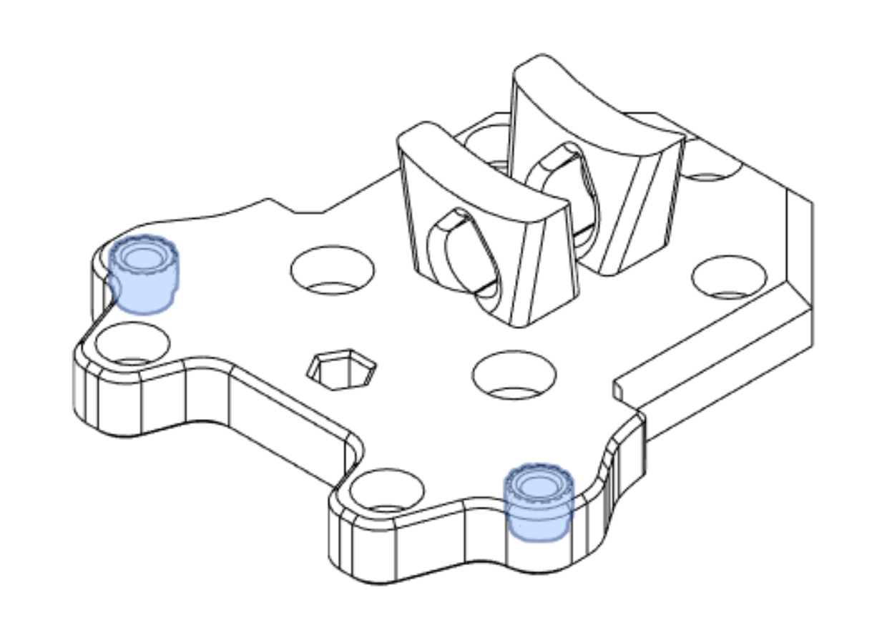
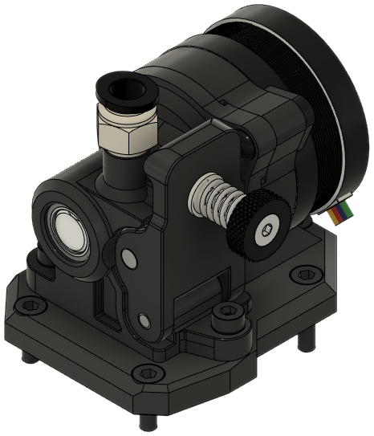
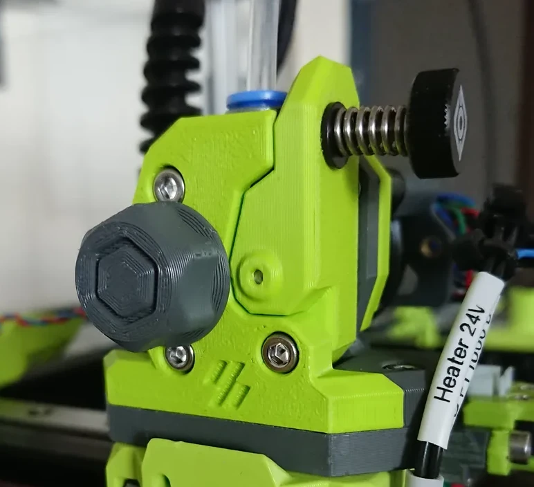

!!! tip
    See [the end of this page](#eva-3-ecosystem-drives) for compatible third party mounts.

<!-- Template

**Origin**: EVA

**Bill of Materials**

| Parts     | Qty |
|-----------|-----|
| [:material-printer-3d-nozzle: `drive_.stl`][]  | 1 |

{ width=256px}

-->

### Annex Sherpa Mini

**Origin**: EVA

**Bill of Materials**

| Parts     | Qty |
|-----------|-----|
| [:material-printer-3d-nozzle: `drive_sherpa_mini.stl`][drive_sherpa_mini]  | 1 |
| NEMA14 stepper            | 1 |
| Assembled Sherpa Mini     | 1 |
| M3-0.5 x 8mm SHCS         | 4 |
| M3-0.5 x 12mm SHCS        | 4 |
| *Lock washer, M3*         | 6 |
| *M3-0.5 x 8mm BHCS*       | 1 |
| *Zip tie*                 | 1 |

This extruder needs 17mm of PTFE.

The Sherpa Mini has two front faces. How the stepper and extruder are secured against vibration depends on the version used:

- Stock: A zip-tie can be used to anchor the stepper motor.
- k-type: An 8mm button head screw is used on the front face of the extruder. A button head screw must be used to clear the ADXL mount on the Front module.

{ width=256px}

??? info "Heat Set Insert Locations"
    { width=256px}

### Bondtech BMG

**Origin**: EVA

**Bill of Materials**

| Parts     | Qty |
|-----------|-----|
| [:material-printer-3d-nozzle: `drive_bmg.stl`][drive_bmg]  | 1 |
| NEMA17 stepper            | 1 |
| Bondtech BMG              | 1 |
| M3-0.5 x 8mm SHCS         | 4 |
| M3-0.5 x 12mm SHCS        | 3 |
| M3-0.5 x 35mm SHCS        | 3 |
| *Lock washer, M3*         | 7 |

This extruder needs 28.9mm of PTFE.

{ width=256px}

### Bondtech LGX

**Origin**: EVA

**Bill of Materials**

| Parts     | Qty |
|-----------|-----|
| [:material-printer-3d-nozzle: `drive_lgx.stl`][drive_lgx]  | 1 |
| NEMA17 stepper            | 1 |
| Bondtech LGX with Copperhead mount | 1 |
| M3-0.5 x 8mm SHCS         | 6 |
| M3-0.5 x 12mm SHCS        | 4 |
| *Lock washer, M3*         | 10 |

This extruder needs 20.8mm of PTFE.

{ width=256px}

### Bondtech LGX Lite

**Origin**: EVA

**Bill of Materials**

| Parts     | Qty |
|-----------|-----|
| [:material-printer-3d-nozzle: `drive_lgx_lite.stl`][drive_lgx_lite]  | 1 |
| NEMA14 stepper        | 1 |
| Bondtech LGX Lite     | 1 |
| M3-0.5 x 6mm SHCS     | 3 |
| M3-0.5 x 8mm SHCS     | 2 |
| M3-0.5 x 12mm SHCS    | 4 |
| *Lock washer, M3*     | 9 |

This extruder needs 14.2mm of PTFE.

{ width=256px}

### LDO Orbiter 1.5

**Origin**: EVA

**Bill of Materials**

| Parts     | Qty |
|-----------|-----|
| [:material-printer-3d-nozzle: `drive_orbiter_1_5.stl`][drive_orbiter_1_5]  | 1 |
| NEMA14 stepper            | 1 |
| LDO Orbiter 1.5           | 1 |
| M3-0.5 x 8mm SHCS         | 4 |
| M3-0.5 x 10mm SHCS        | 2 |
| M3-0.5 x 12mm SHCS        | 3 |
| Heat Set Insert, M3x5x4   | 2 |
| *Lock washer, M3*         | 11 |

This extruder needs 22.2mm of PTFE.

{ width=256px}

??? info "Heat Set Insert Locations"
    { width=256px}

### LDO Orbiter 2.0

**Origin**: EVA

**Bill of Materials**

| Parts     | Qty |
|-----------|-----|
| [:material-printer-3d-nozzle: `drive_orbiter_2_0.stl`][drive_orbiter_2_0]  | 1 |
| NEMA14 stepper            | 1 |
| LDO Orbiter 2.0           | 1 |
| M3-0.5 x 8mm SHCS         | 4 |
| M3-0.5 x 10mm SHCS        | 2 |
| M3-0.5 x 12mm SHCS        | 3 |
| Heat Set Insert, M3x5x4   | 2 |
| *Lock washer, M3*         | 9 |

This extruder needs 17.95mm of PTFE.

{ width=256px}

??? info "Heat Set Insert Locations"
    { width=256px}

## EVA 3 Ecosystem Drives

These are mounts from the larger EVA ecosystem that link to external sites.

### Galileo 2 StandAlone

- **Author**: [cuiviemen](https://www.printables.com/@cuiviemen_127292)
- **Inserts/Hex Nuts**: M3x4.6x4 inserts

[Link](https://www.printables.com/model/648710-galileo-2-sa-extruder-for-eva3){ .md-button}

{width="200px"}

### Annex Sherpa Micro

- **Author**: [Psych0h3ad](https://www.printables.com/@Psych0h3ad_168275)
- **Inserts/Hex Nuts**: M3x4.6x4 inserts

[Link](https://www.printables.com/model/224597-sherpa-micro-mount-for-eva-3){ .md-button}

{width="200px"}

### E3D Titan

- **Author**: [Chana Kennington](https://www.printables.com/@ChanaKenningt_484474)
- **Inserts/Hex Nuts**: None

[Link](https://www.printables.com/model/424090-eva3-titan-extruder-mount){ .md-button }

{width="200px"}

### VzBoT3D Vz-HextrudORT Low

- **Author**: [Pr20100](https://www.printables.com/@Pr20100)
- **Inserts/Hex Nuts**: M3x4.6x4 inserts or hex nuts

[Link](https://www.printables.com/model/355751-eva-3-vz-hextrudort-low-extruder-mounting-plate){ .md-button }

{width="200px"}

