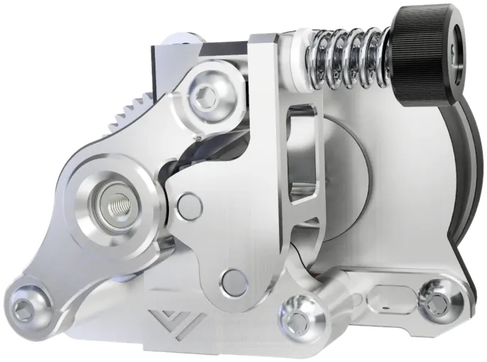

!!! tip
    See [the end of this page](#eva-3-ecosystem-drives) for compatible third party mounts.




## E34M1 Native Drives




{{ format.comp_entry(comp, prefix=prefix, img_width="200px") }}


## EVA 3 Ecosystem Drives

These are mounts from the larger EVA ecosystem that link to external sites.

### Galileo 2 StandAlone

- **Author**: [cuiviemen](https://www.printables.com/@cuiviemen_127292)
- **Inserts/Hex Nuts**: M3x4.6x4 inserts

[Link](https://www.printables.com/model/648710-galileo-2-sa-extruder-for-eva3){ .md-button}

{width="200px"}

### Annex Sherpa Micro

- **Author**: [Psych0h3ad](https://www.printables.com/@Psych0h3ad_168275)
- **Inserts/Hex Nuts**: M3x4.6x4 inserts

[Link](https://www.printables.com/model/224597-sherpa-micro-mount-for-eva-3){ .md-button}

{width="200px"}

### E3D Titan

- **Author**: [Chana Kennington](https://www.printables.com/@ChanaKenningt_484474)
- **Inserts/Hex Nuts**: None

[Link](https://www.printables.com/model/424090-eva3-titan-extruder-mount){ .md-button }

{width="200px"}

### ProtoXtruder 2.0

- **Author**: [Ultrazauberer](https://www.printables.com/@Ultrazauberer_772128)
- **Inserts/Hex Nuts**: M3x5x4 inserts

[Link](https://www.printables.com/model/1142327-eva-30-e34m1-protoxtruder-20-mount){ .md-button }

{width="200px"}

### VzBoT3D Vz-HextrudORT Low

- **Author**: [Pr20100](https://www.printables.com/@Pr20100)
- **Inserts/Hex Nuts**: M3x4.6x4 inserts or hex nuts

[Link](https://www.printables.com/model/355751-eva-3-vz-hextrudort-low-extruder-mounting-plate){ .md-button }

{width="200px"}

