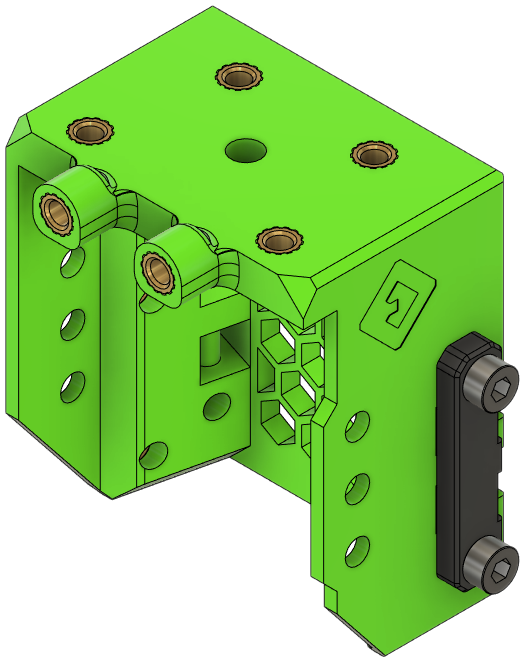

There are three versions of the front module:

- [Basic Front](#basic): No input shaper mount; saves some weight.
- [ADXL Front](#adxl345): Mounts an ADXL345 input shaper (similar to stock EVA 3).
- [FYSETC Portable Input Shaper Front](#fysetc-portable-input-shaper): Mounts a FYSETC portable input shaper.

## Basic

**Description**

Lightweight version of the Front that does not mount an accelerometer.

[**Revision:**](#revision-history) v0.5

**Bill of Materials**

| Parts     | Qty |
|-----------|-----|
| [:material-printer-3d-nozzle: `front_basic.stl`][front_basic]  | 1 |
| [:material-printer-3d-nozzle: `belt_grabber.stl`][belt_grabber] | 2 |
| M3-0.5 x 6mm SHCS  | 4    |
| Heat Set Insert, M3x5x4   | 14   |

{ width=256px}

??? info "Heat Set Insert Locations"
    

    

    {width=300}
    

    

    {width=300}
    

    

    {width=300}
    

    

## ADXL345

**Description**

Modification of the stock EVA Front for Mercury One. This mounts an ADXL345 accelerometer.

[**Revision:**](#revision-history) v0.5

**Bill of Materials**

| Parts     | Qty |
|-----------|-----|
| [:material-printer-3d-nozzle: `front_adxl345.stl`][front]  | 1 |
| [:material-printer-3d-nozzle: `belt_grabber.stl`][belt_grabber] | 2 |
| M3-0.5 x 6mm SHCS  | 4    |
| Heat Set Insert, M3x5x4   | 14   |
| *ADXL345*                 | *1*  |
| *M3-0.5 x 8mm SHCS*| *2*  |

{ width=256px}

??? info "Heat Set Insert Locations"
    

    

    {width=300}
    

    

    {width=300}
    

    

    {width=300}
    

    

    {width=300}
    

    

## FYSETC Portable Input Shaper

**Description**

Slightly modified Front that mounts a FYSETC portable input shaper.

[**Revision:**](#revision-history) v0.5

**Bill of Materials**

| Parts     | Qty |
|-----------|-----|
| [:material-printer-3d-nozzle: `front_fysetc_pis.stl`][front_pis]  | 1 |
| [:material-printer-3d-nozzle: `belt_grabber.stl`][belt_grabber] | 2 |
| M3-0.5 x 6mm SHCS         | 4 |
| Heat Set Insert, M3x5x4   | 16 |
| *FYSETC Portable Input Shaper* | *1* |
| *M3-0.5 x 6mm SHCS*       | *2* |

{ width=256px}

??? info "Heat Set Insert Locations"
    

    

    {width=300}
    

    

    {width=300}
    

    

    {width=300}
    

    

    {width=300}
    

    

## Revision History

| Date | File | Version | Description |
|------|------|---------|-------------|
| 23/11/02 | `front_basic.stl`  | v0.5 | Added front without input shaper mount; uses new template. |
| 23/11/02 | `front_fysetc_pis.stl` | v0.5 | Renamed from `pis_front.stl`; uses new template. |
| 23/11/02 | `front_adxl345.stl` | v0.5 | Renamed from `stock_front.stl`; uses new template. |
| 23/11/02 | `belt_grabber.stl` | v0.5 | Uses new template. |
| 23/06/08 | `pis_front.stl`    | v0.4 | Tweaked belts & shaper mount. |
| 23/06/08 | `stock_front.stl`  | v0.4 | Tweaked belts. |
| 23/06/08 | `belt_grabber.stl` | v0.4 | Tweaked belts. |
| 23/05/13 | `pis_front.stl`    | v0.3 | Fix for shaper mount. |
| 23/04/24 | `belt_grabber.stl` | v0.2 | Better belt grip. |
| 23/04/25 | `pis_front.stl`    | v0.2 | Fixed belt angle. |
| 23/04/25 | `stock_front.stl`  | v0.2 | Fixed belt angle. |
| 23/01/24 | `pis_front.stl`    | v0.1 | Initial commit. |
| 23/01/10 | `stock_front.stl`  | v0.1 | Initial commit. |
| 23/01/10 | `belt_grabber.stl` | v0.1 | Initial commit. |