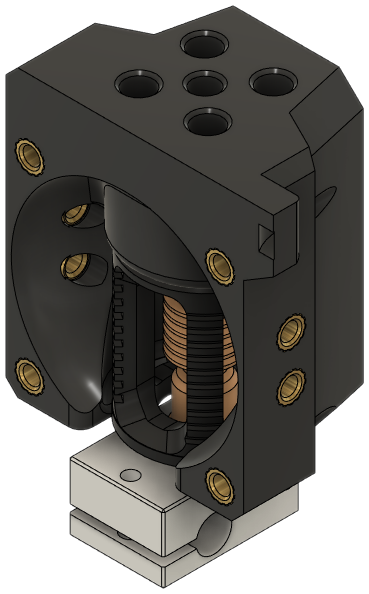
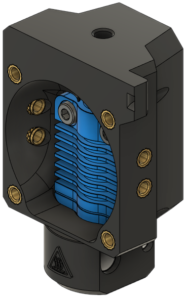

!!! tip 
    *This is not a full list of known hotend mounts*. See **[Hotend Compatibility](../compat/hotends.md)** for a larger list that includes compatible third party mounts.

These are existing hotend mounts that have been modified for ease of installation:

- They are converted to better accept M3x5x4 inserts, and
- It is not necessary to punch open the screw holes for top-mounted hotends.

Other EVA 3 hotend mounts remain compatibile with E34M1; see the [Hotend Compatibility](../compat/hotends.md) page for the full list.

<!-- Template

**Origin**: [Name]() by [Name]()

**Bill of Materials**

| Parts     | Qty |
|-----------|-----|
| [:material-printer-3d-nozzle: `hotend_.stl`][]  | 1 |
| Fan, 40mm x 10mm          | 1 |
| Screw, M3-0.5 x 6mm       | 4 |
| Screw, M3-0.5 x 12mm      | 4 |
| Heat Set Insert, M3x5x4   | 8 |

{ width=256px}

-->

## E3D 

### Revo Voron

**Origin**: EVA

**Bill of Materials**

| Parts     | Qty |
|-----------|-----|
| [:material-printer-3d-nozzle: `hotend_revo_voron.stl`][hotend_revo_voron]  | 1 |
| E3D Revo Voron            | 1 |
| Fan, 40mm x 10mm          | 1 |
| Screw, M2.5-0.45 x 8mm SHCS | 4 |
| Screw, M3-0.5 x 6mm       | 4 |
| Screw, M3-0.5 x 12mm      | 4 |
| Heat Set Insert, M3x5x4   | 8 |

{ width=256px}

## Phaetus

### Dragon BMO

!!! info "Design by [3DP and Me](https://www.printables.com/@3DPandMe)"

**Origin**: [EVA3 dragon hotend mount (Insert)](https://www.printables.com/model/200853-eva3-dragon-hotend-mount-insert) by [3DP and Me](https://www.printables.com/@3DPandMe)

**Bill of Materials**

| Parts     | Qty |
|-----------|-----|
| [:material-printer-3d-nozzle: `hotend_dragon_bmo.stl`][hotend_dragon_bmo]  | 1 |
| Phaetus Dragon BMO (all versions) | 1 |
| Fan, 40mm x 10mm          | 1 |
| Screw, M2.5-0.45 x 8mm SHCS | 4 |
| Screw, M3-0.5 x 6mm       | 4 |
| Screw, M3-0.5 x 12mm      | 4 |
| Heat Set Insert, M3x5x4   | 8 |

{ width=256px}

### Dragonfly BMO

**Origin**: EVA

**Bill of Materials**

| Parts     | Qty |
|-----------|-----|
| [:material-printer-3d-nozzle: `hotend_dragonfly_bmo.stl`][hotend_dragonfly_bmo]  | 1 |
| Dragonfly BMO             | 1 |
| Fan, 40mm x 10mm          | 1 |
| Screw, M2.5-0.45 x 8mm SHCS | 4 |
| Screw, M3-0.5 x 6mm       | 4 |
| Screw, M3-0.5 x 12mm      | 4 |
| Heat Set Insert, M3x5x4   | 8 |

{ width=256px}

### Dragonfly BMS

!!! info "Design by [themacboy](https://www.printables.com/@themacboy_276431)"

**Origin**: [Phaetus DragonFly BMS for EVA v.3 carriage](https://www.printables.com/model/249767-phaetus-dragonfly-bms-for-eva-v3-carriage/files) by [themacboy](https://www.printables.com/@themacboy_276431)

**Bill of Materials**

Lock washers to mount the hotend are optional.

| Parts     | Qty |
|-----------|-----|
| [:material-printer-3d-nozzle: `hotend_dragonfly_bms.stl`][hotend_dragonfly_bms]  | 1 |
| Dragonfly BMS             | 1 |
| Fan, 40mm x 10mm          | 1 |
| Screw, M3-0.5 x 6mm       | 4 |
| Screw, M3-0.5 x 12mm      | 4 |
| Screw, M3-0.5 x 16mm      | 2 |
| *Lock washer, M3*           | *2* |
| Heat Set Insert, M3x5x4   | 10 |

{ width=256px}

### Rapido

**Origin**: EVA

**Bill of Materials**

| Parts     | Qty |
|-----------|-----|
| [:material-printer-3d-nozzle: `hotend_rapido.stl`][hotend_rapido]  | 1 |
| Rapido                    | 1 |
| Fan, 40mm x 10mm          | 1 |
| Screw, M2.5-0.45 x 8mm SHCS | 4 |
| Screw, M3-0.5 x 6mm       | 4 |
| Screw, M3-0.5 x 12mm      | 4 |
| Heat Set Insert, M3x5x4   | 8 |

{ width=256px}

