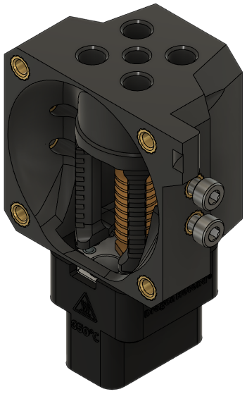

!!! tip
    See [the end of this page](#eva-3-ecosystem-hotends) for compatible third party mounts.

<!-- Template

**Origin**: [Name]() by [Name]()

**Bill of Materials**

| Parts     | Qty |
|-----------|-----|
| [:material-printer-3d-nozzle: `hotend_.stl`][]  | 1 |
| Fan, 40mm x 10mm          | 1 |
| M3-0.5 x 6mm       | 4 |
| M3-0.5 x 12mm      | 4 |
| Heat Set Insert, M3x5x4   | 8 |

{ width=256px}

-->

## E34M1 Native Hotends

### 3D Passion Nova

**Origin**: EVA

**Bill of Materials**

| Parts     | Qty |
|-----------|-----|
| [:material-printer-3d-nozzle: `hotend_nova.stl`][hotend_nova]  | 1 |
| 3D Passion Nova               | 1 |
| Fan, 40mm x 10mm              | 1 |
| M2.5-0.45 x 8mm SHCS          | 2 |
| M3-0.5 x 6mm SHCS             | 4 |
| M3-0.5 x 12mm SHCS            | 4 |
| Heat Set Insert, M3x5x4       | 8 |

This hotend requires 39.65mm of PTFE tubing. It uses standard-length Bottom Horns.

{ width=256px}

### E3D REVO Voron

**Origin**: EVA

**Bill of Materials**

| Parts     | Qty |
|-----------|-----|
| [:material-printer-3d-nozzle: `hotend_revo_voron.stl`][hotend_revo_voron]  | 1 |
| E3D Revo Voron                | 1 |
| Fan, 40mm x 10mm              | 1 |
| M2.5-0.45 x 8mm SHCS          | 4 |
| M3-0.5 x 6mm SHCS             | 4 |
| M3-0.5 x 12mm SHCS            | 4 |
| Heat Set Insert, M3x5x4       | 8 |

This hotend requires 27.15mm of PTFE tubing. It uses standard-length Bottom Horns.

{ width=256px}

### Phaetus Dragon BMO

!!! info "Design by [3DP and Me](https://www.printables.com/@3DPandMe)"

**Origin**: [EVA3 dragon hotend mount (Insert)](https://www.printables.com/model/200853-eva3-dragon-hotend-mount-insert) by [3DP and Me](https://www.printables.com/@3DPandMe)

**Bill of Materials**

| Parts     | Qty |
|-----------|-----|
| [:material-printer-3d-nozzle: `hotend_dragon_bmo.stl`][hotend_dragon_bmo]  | 1 |
| Phaetus Dragon BMO (all versions) | 1 |
| Fan, 40mm x 10mm          | 1 |
| M2.5-0.45 x 8mm SHCS      | 4 |
| M3-0.5 x 6mm SHCS         | 4 |
| M3-0.5 x 12mm SHCS        | 4 |
| Heat Set Insert, M3x5x4   | 8 |

This hotend requires 24.5mm of PTFE tubing. It uses standard-length Bottom Horns.

{ width=256px}

### Phaetus Dragon UHF

**Origin**: EVA

**Bill of Materials**

| Parts     | Qty |
|-----------|-----|
| [:material-printer-3d-nozzle: `hotend_dragon_uhf.stl`][hotend_dragon_uhf]  | 1 |
| Phaetus Dragon UHF            | 1 |
| Fan, 40mm x 10mm              | 1 |
| M2.5-0.45 x 8mm SHCS          | 4 |
| M3-0.5 x 6mm SHCS             | 4 |
| M3-0.5 x 12mm SHCS            | 4 |
| Heat Set Insert, M3x5x4       | 8 |

This hotend requires 15mm of PTFE tubing. It uses standard-length Bottom Horns (*not* UHF).

{ width=256px}

### Phaetus Dragonfly BMO

**Origin**: EVA

**Bill of Materials**

| Parts     | Qty |
|-----------|-----|
| [:material-printer-3d-nozzle: `hotend_dragonfly_bmo.stl`][hotend_dragonfly_bmo]  | 1 |
| Dragonfly BMO                 | 1 |
| Fan, 40mm x 10mm              | 1 |
| M2.5-0.45 x 8mm SHCS          | 4 |
| M3-0.5 x 6mm SHCS             | 4 |
| M3-0.5 x 12mm SHCS            | 4 |
| Heat Set Insert, M3x5x4       | 8 |

This hotend requires 39.5mm of PTFE tubing. It uses standard-length Bottom Horns.

{ width=256px}

### Phaetus Dragonfly BMS

!!! info "Design by [themacboy](https://www.printables.com/@themacboy_276431)"

!!! note "This mount is only compatible with the 6-fin heatsink"

**Origin**: [Phaetus DragonFly BMS for EVA v.3 carriage](https://www.printables.com/model/249767-phaetus-dragonfly-bms-for-eva-v3-carriage/files) by [themacboy](https://www.printables.com/@themacboy_276431)

**Bill of Materials**

Lock washers to mount the hotend are optional.

| Parts     | Qty |
|-----------|-----|
| [:material-printer-3d-nozzle: `hotend_dragonfly_bms.stl`][hotend_dragonfly_bms]  | 1 |
| Dragonfly BMS             | 1 |
| Fan, 40mm x 10mm          | 1 |
| M3-0.5 x 6mm SHCS         | 4 |
| M3-0.5 x 12mm SHCS        | 4 |
| M3-0.5 x 16mm SHCS        | 2 |
| *Lock washer, M3*         | *2* |
| Heat Set Insert, M3x5x4   | 10 |

This hotend requires approximately 20mm of PTFE tubing. It uses standard-length Bottom Horns.

{ width=256px}

### Phaetus Rapido

**Origin**: EVA

**Bill of Materials**

| Parts     | Qty |
|-----------|-----|
| [:material-printer-3d-nozzle: `hotend_rapido.stl`][hotend_rapido]  | 1 |
| Rapido                        | 1 |
| Fan, 40mm x 10mm              | 1 |
| M2.5-0.45 x 8mm SHCS          | 4 |
| M3-0.5 x 6mm SHCS             | 4 |
| M3-0.5 x 12mm SHCS            | 4 |
| Heat Set Insert, M3x5x4       | 8 |

This hotend requires 29.8mm of PTFE tubing. It uses standard-length Bottom Horns.

{ width=256px}

### Phaetus Rapido UHF

**Origin**: EVA, modified from Rapido mount

**Bill of Materials**

| Parts     | Qty |
|-----------|-----|
| [:material-printer-3d-nozzle: `hotend_rapido_uhf.stl`][hotend_rapido_uhf]  | 1 |
| Rapido UHF                    | 1 |
| Fan, 40mm x 10mm              | 1 |
| M2.5-0.45 x 8mm SHCS          | 4 |
| M3-0.5 x 6mm SHCS             | 4 |
| M3-0.5 x 12mm SHCS            | 4 |
| Heat Set Insert, M3x5x4       | 8 |

This hotend requires 27.23mm of PTFE tubing. It requires UHF Bottom Horns.

{ width=256px}

### Slice Engineering Mosquito

**Origin**: EVA

**Bill of Materials**

| Parts     | Qty |
|-----------|-----|
| [:material-printer-3d-nozzle: `hotend_mosquito.stl`][hotend_mosquito]  | 1 |
| Mosquito                      | 1 |
| Fan, 40mm x 10mm              | 1 |
| M2.5-0.45 x 8mm SHCS          | 2 |
| M3-0.5 x 6mm SHCS             | 4 |
| M3-0.5 x 12mm SHCS            | 4 |
| Heat Set Insert, M3x5x4       | 8 |

This hotend resquires 22.6mm of PTFE tubing. It requires the trihorn Bottom Horns.

{ width=256px}

## EVA 3 Ecosystem Hotends

These hotends are third party mounts that use either EVA-style inserts or hex nuts. They may or may not have a bill of materials.

### E3D Revo Micro

- **Author**: [hebijirik](https://www.printables.com/@hebijirik_84624)
- **Inserts/Hex Nuts**: hex nuts

[Link](https://www.printables.com/model/225581-eva-3-revo-micro-hotend/files){.md-button}

{width="200px"}

### E3D V6 & Revo V6

- **Author**: [3DP-MAMSIH](https://www.printables.com/@3DPMAMSIH)
- **Inserts/Hex Nuts**: M3x4.6x4 inserts or hex nuts

[Link](https://www.printables.com/model/201093-eva-30-e3dv6-revo-revo-micro-hotends-mount){.md-button}

{width="200px"}

