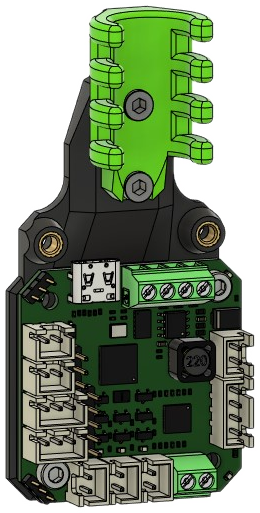

!!! tip "Important"
    These mounts are designed for **NEMA17** steppers. There are several off-the-shelf options for **NEMA14** steppers:

    - ZeroG Discord members can use TurtleCrawler's [CANbus 36 mounts](https://discord.com/channels/747612067951018075/1058784239539191838/1058784239539191838)
    - [https://github.com/KayosMaker/CANboard_Mounts](https://github.com/KayosMaker/CANboard_Mounts)

!!! warning "Warning: Deprecated"
    The files on this page are deprecated and may be removed in the future.

This page contains parts for mounting toolhead PCBs on the back of a NEMA17 stepper. Optional shrouds are used to cover the PCB wiring.

The first half of this page contains mounts for both NEMA14 ("36") and NEMA17 ("42") PCBs. Examples of '36 PCBs are the BIGTREETECH EBB36 and  Mellow Fly SHT36. An example of a '42 PCB is the BIGTREETECH EBB42. Variants of each mount are available for both cable guides and drag chains.

## PCB Mounts

### '36 PCB, Cable Guide

**Description**

Mounts a '36 toolhead PCB with anchor points a cable guide. Meant for umbilical users.

**Bill of Materials**

| Parts     | Qty | Notes |
|-----------|-----|-------|
| [:material-printer-3d-nozzle: `pcb36_mount.stl`][pcb36_mount] | 1 | |
| [:material-printer-3d-nozzle: `cable_guide.stl`][cable_guide] | 1 | |
| Toolhead PCB      | 1 | |
| Screw, M3-0.5 x 25mm | 2 | |
| Screw, M3-0.5 x 6mm  | 4 | May substitute two (2) 8mm screws, if desired. |
| Heat Set Insert, M3x5x4 | 6 | |

{ width=200px }

??? info "Heat Set Insert Locations"
    { width=256px}

### '36 PCB, Drag Chain

**Description**

Mounts a '36 toolhead PCB with anchor points for an open drag chain.

**Bill of Materials**

| Parts     | Qty | Notes |
|-----------|-----|-------|
| [:material-printer-3d-nozzle: `pcb36_mount_cable_chain.stl`][pcb36_mount_cable_chain] | 1 | |
| Toolhead PCB      | 1 | |
| Screw, M3-0.5 x 25mm | 2 | |
| Screw, M3-0.5 x 6mm  | 5 | May substitute 8mm screws, if desired. |
| Heat Set Insert, M3x5x4 | 7 | |

{ width=200px }

??? info "Heat Set Insert Locations"
    { width=256px}

### '42 PCB, Cable Guide

**Description**

Mounts a '46 toolhead PCB with anchor points a cable guide. Meant for umbilical users.

**Bill of Materials**

| Parts     | Qty | Notes |
|-----------|-----|-------|
| [:material-printer-3d-nozzle: `pcb42_mount.stl`][pcb42_mount] | 1 | |
| [:material-printer-3d-nozzle: `cable_guide.stl`][cable_guide] | 1 | |
| Toolhead PCB      | 1 | |
| Screw, M3-0.5 x 25mm | 2 | |
| Screw, M3-0.5 x 6mm  | 4 | May substitute two (2) 8mm screws, if desired. |
| Heat Set Insert, M3x5x4 | 6 | |

{ width=200px }

??? info "Heat Set Insert Locations"
    { width=256px}

### '42 PCB, Drag Chain

**Description**

Mounts a '46 toolhead PCB with anchor points for an open drag chain.

**Bill of Materials**

| Parts     | Qty | Notes |
|-----------|-----|-------|
| [:material-printer-3d-nozzle: `pcb42_mount_cable_chain.stl`][pcb42_mount_cable_chain] | 1 | |
| Toolhead PCB      | 1 | |
| Screw, M3-0.5 x 25mm | 2 | |
| Screw, M3-0.5 x 6mm  | 5 | May substitute 8mm screws, if desired. |
| Heat Set Insert, M3x5x4 | 7 | |

{ width=200px }

??? info "Heat Set Insert Locations"
    { width=200px}

## PCB Shrouds

These shrouds cover the PCB and wiring for a PCB mount.

PCB shrouds come in three styles:

- Stock
- Cat face
- 30mm Fan

The cat face shroud is purely cosmetic and uses the same materials as the stock shroud.

### Basic

| Parts     | Qty |
|-----------|-----|
| [:material-printer-3d-nozzle: `pcb_shroud.stl`][pcb_shroud] or [:material-printer-3d-nozzle: `pcb_shroud_cat.stl`][pcb_shroud_cat]| 1 |
| Screw, M3-0.5 x 35mm | 2 |

{ width=400px }

### 30mm Fan

| Parts     | Qty |
|-----------|-----|
| [:material-printer-3d-nozzle: `pcb_shroud.stl`][pcb_shroud_30mm] | 1 |
| Screw, M3-0.5 x 35mm | 2 |
| Axial Fan, 30mm x 10mm | 1 |
| Screw, M3-0.5 x 16mm | 2 |
| Heat Set Insert, M3x5x4 | 4 |

{ width=200px }

