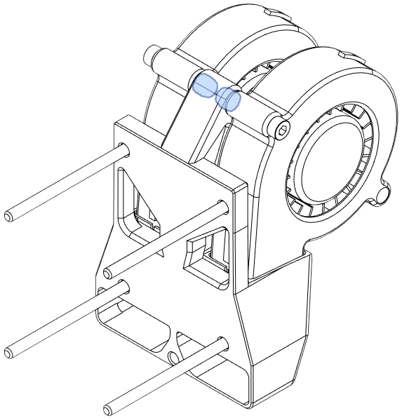
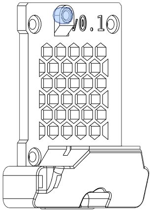

The rear module acts as a part cooling fan inlet. An adapter is available to use stock cooling inlets (e.g., for dual-5015 fans).

Several options are available:

- Dual 5015 Rear Inlet
- Low-Profile Cooling Inlet: Modified stock 5015 inlet with lower height.
- Low-Profile Sideways Cooling Inlet: Low-height sideways mount for a 5015 part fan.
- Sideways Cooling Inlet for Beacon: modified version of the above for Beacon.
- Stock Rear Inlet Adapter: Lightweight adapter for stock EVA rear inlets.

### Dual 5015 Rear Inlet

**Description**

This rear inlet is modified from the stock 5015. It offers plenty of airflow at the cost of a larger toolhead in the Y and Z axes.

[**Revision:**](#revision-history) v0.1

**Bill of Materials**

| Parts     | Qty |
|-----------|-----|
| [:material-printer-3d-nozzle: `dual_5015_inlet.stl`][dual_5015_inlet] | 1 |
| 5015 Radial Fan           | 2 |
| M3-0.5 x 6mm SHCS         | 1 |
| M3-0.5 x 20mm SHCS        | 2 |
| M3-0.5 x 45mm SHCS        | 4 |
| Heat Set Insert, M3x5x4   | 2 |
| *Lock washer, M3*         | *5* |

{ width=256px}

??? "Heat Set Inserts"
    { width=256px}

### Low-Profile Cooling Inlet

**Description**

This is a modified version of the stock EVA 3 cooling inlet. It has a much-reduced height to avoid clearance issues with BMG extruders.

[**Revision:**](#revision-history) v0.1

**Origin:** EVA

**Bill of Materials**

| Parts     | Qty |
|-----------|-----|
| [:material-printer-3d-nozzle: `rear_5015_inlet.stl`][5015_inlet] | 1 |
| 5015 Radial Fan           | 1 |
| M3-0.5 x 6mm SHCS         | 1 |
| M3-0.5 x 20mm SHCS        | 1 |
| M3-0.5 x 45mm SHCS        | 4 |
| Heat Set Insert, M3x5x4   | 1 |
| *Lock washer, M3*         | *5* |

{ width=256px}

??? "Heat Set Inserts"
    { width=256px}

### Low-Profile Sideways Cooling Inlet

**Description**

This is a custom cooling inlet with that maximizes available build area.

Use this if you are not sure which cooling inlet is best for you.

[**Revision:**](#revision-history) v0.1

**Bill of Materials**

| Parts     | Qty |
|-----------|-----|
| [:material-printer-3d-nozzle: `rear_5015_inlet_sideways.stl`][5015_sideways_inlet] | 1 |
| 5015 Radial Fan           | 1 |
| M3-0.5 x 6mm SHCS         | 1 |
| M3-0.5 x 20mm SHCS        | 1 |
| M3-0.5 x 45mm SHCS        | 4 |
| Heat Set Insert, M3x5x4   | 1 |
| *Lock washer, M3*         | *5* |

{ width=256px}

??? "Heat Set Inserts"
    { width=256px}

### Sideways Cooling Inlet for Beacon

**Description**

!!! info "Based on work by [cuiviemen](https://www.printables.com/@cuiviemen_127292)"

This modification of the the sideways inlet has clearance for the Beacon connector and a cutout with zip tie anchor for the USB cable. This inlet is compatible with both [dual horn](bottom.md#dual-horns-for-beacon) and [trihorn](bottom.md#trihorns-for-beacon) beacon ducts.

The inlet uses a **flat head cap screw** to secure the duct to the bottom horns. This screw may be left out if necessary, but may provide a less secure seal for the duct. `screw_cap.stl` is used to cover the screw so that it cannot loosen and contact the Beacon connector.

[**Revision:**](#revision-history) v0.1

**Origin**: [Beacon 3D mount solution for E34M1 - EVA 3 for Mercury One](https://www.printables.com/model/438193-beacon-3d-mount-solution-for-e34m1-eva-3-for-mercu) by [cuiviemen](https://www.printables.com/@cuiviemen_127292)

**Bill of Materials**

Note that the M3 x 6mm screw is a flat head cap screw.

| Parts     | Qty |
|-----------|-----|
| [:material-printer-3d-nozzle: `rear_inlet_beacon.stl`][rear_inlet_beacon] | 1 |
| [:material-printer-3d-nozzle: `screw_cap.stl`][beacon_screw_cap] |1 |
| 5015 Radial Fan           | 1 |
| [:material-cart: M3-0.5 x 6mm FHCS][bom_m3x6_fhcs] | 1 |
| M3-0.5 x 20mm SHCS        | 1 |
| M3-0.5 x 45mm SHCS        | 4 |
| Heat Set Insert, M3x5x4   | 1 |
| *Lock washer, M3*         | *4* |

{ width=350px}

??? "Heat Set Inserts"
    { width=256px}

### Stock Rear Inlet Adapter

!!! warning "Caution: Does not work with the 40mm fan intake. See [Issue #8](https://github.com/jon-harper/E34M1/issues/8)."

!!! info "Based on work by [Psych0h3ad](https://www.printables.com/social/168275-psych0h3ad/about)"

This allows stock EVA 3 rear cooling inlets to be used (e.g., [dual 5015 fans](https://main.eva-3d.page/heat_insert/cooling_inlet/dual_5015/)), or any mods based on the stock inlets.

[**Revision:**](#revision-history) v0.1

**Origin**: [EVA 3 Beltless backplate for dual 5015](https://www.printables.com/model/430281-eva-3-beltless-backplate-for-dual-5015) by [Psych0h3ad](https://www.printables.com/social/168275-psych0h3ad/about)

**Bill of Materials**

| Parts     | Qty |
|-----------|-----|
| [:material-printer-3d-nozzle: `stock_intake_adapter.stl`][rear_intake_adapter] | 1 |
| M3-0.5 x 45mm SHCS        | 4 |
| *Lock washer, M3*         | *4* |

{ width=256px}

## Revision History

| Date | File | Version | Description |
|------|------|---------|-------------|
| 23/04/25 | `dual_5015_inlet.stl`               | v0.1 | Initial release. |
| 23/01/10 | `rear_5015_inlet.stl`               | v0.1 | Initial commit. |
| 23/04/11 | `rear_5015_inlet_sideways.stl`      | v0.1 | Initial tracked release. |
| 23/04/11 | `rear_inlet_beacon`                 | v0.1 | Initial release. |
| 23/04/11 | `screw_cap.stl`\*                   | v0.1 | Initial release. |
| 23/04/18 | `stock_intake_adapter`              | v0.1 | Initial tracked release. |
