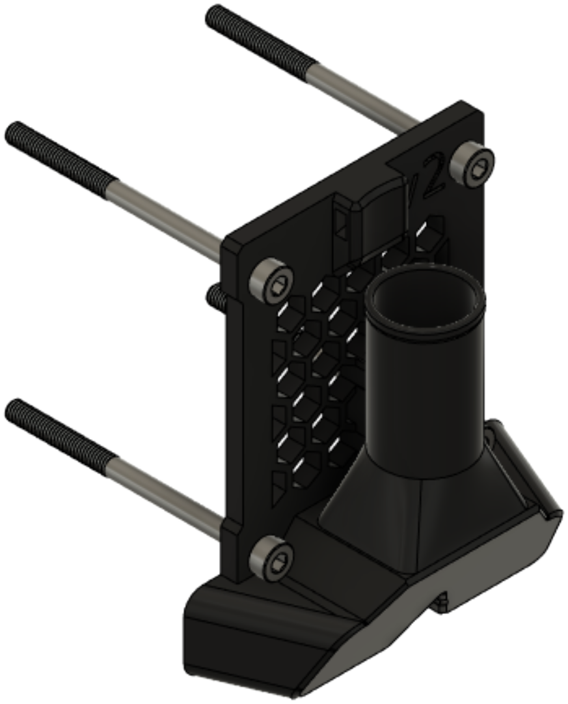
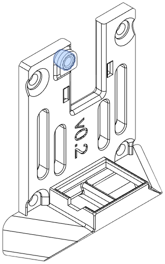
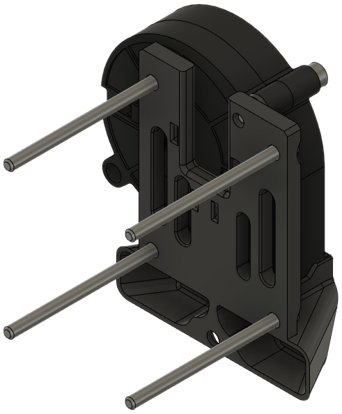
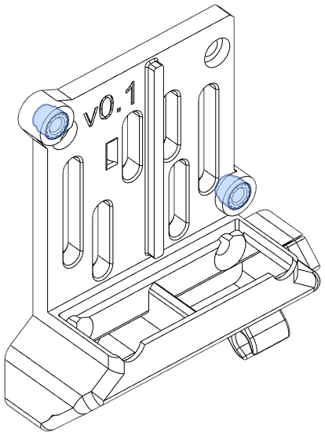
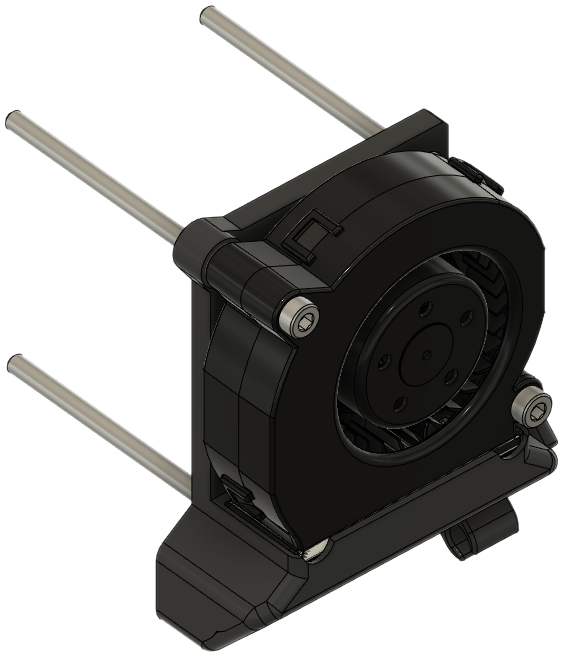

The rear module acts as a part cooling fan inlet. An adapter is available to use stock cooling inlets (e.g., 40mm x 28mm fans).

Several options are available:

- [Single 5015 Fan](#single-5015-fan): Use this if you aren't sure what's best.
- [Single 5015 Fan (Beacon)](#single-5015-fan-beacon): The above, modified for Beacon ABL probes.
- [Single 5015 Fan (EVA-style)](#single-5015-fan-eva-style): Modified stock 5015 inlet with lower height.
- [Single Papst RLF35-8](#single-papst-rlf35-8): Fits a Papst [RLF35-8][bom_papst_rlf35] blower.
- [Single Papst RLF35-8](#single-papst-rlf35-8-beacon): The above, modified for Beacon ABL probes.
- [Dual 5015 Fans](#dual-5015-fan): Redesigned from EVA stock for a lower profile.
- [Dual 5015 Fans (Owl Eyes)](#dual-5015-fan-owl-eyes): Alternative fan layout for smaller footprint.
- [15mm CPAP](#15mm-cpap): For remote cooling.
- [15mm CPAP (Beacon)](#15mm-cpap-beacon): The above, modified for Beacon ABL probes.
- [Stock Rear Inlet Adapter](#eva-rear-inlet-adapter): Lightweight adapter for stock EVA rear inlets.

### 15mm CPAP

**Description**

This inlet accepts a 15mm ID CPAP hose, secured by zip ties.

CPAP hoses typically come with a latching mechanism on each end; these must be removed.

[**Revision:**](#revision-history) v3

**Bill of Materials**

| Parts     | Qty |
|-----------|-----|
| [:material-printer-3d-nozzle: `rear_15mm_cpap.stl`][rear_15mm_cpap] | 1 |
| M3-0.5 x 6mm SHCS         | 1 |
| M3-0.5 x 45mm SHCS        | 4 |
| Zip ties                  | 2 |
| 15mm CPAP hose            | 1 |
| *Lock washer, M3*         | *4* |

{ width=256px}

### 15mm CPAP (Beacon)

**Description**

This inlet accepts a 15mm ID CPAP hose, held in place zip ties. This is modified to work with Beacon probes.

CPAP hoses typically come with a latching mechanism on each end; these must be cut off.

!!! warning 
    The inlet uses a **flat head cap screw** to secure the duct to the bottom horns. This screw may be left out if necessary, but may provide a less secure seal for the duct. `screw_cap.stl` is used to cover the screw so that it cannot loosen and contact the Beacon connector.

[**Revision:**](#revision-history) v3

**Bill of Materials**

| Parts     | Qty |
|-----------|-----|
| [:material-printer-3d-nozzle: `rear_15mm_cpap_beacon.stl`][rear_15mm_cpap_beacon] | 1 |
| [:material-printer-3d-nozzle: `screw_cap.stl`][beacon_screw_cap] |1 |
| [:material-cart: M3-0.5 x 6mm FHCS][bom_m3x6_fhcs] | 1 |
| M3-0.5 x 45mm SHCS        | 4 |
| Zip ties                  | 1-2 |
| 15mm CPAP hose            | 1 |
| *Lock washer, M3*         | *4* |

{ width=256px}

<!-- ### 22mm CPAP Rear Inlet

**Description**

This inlet accepts a 22mm (19mm ID) CPAP hose. It is held in place with two (2) zip ties.

CPAP hoses typically come with a latching mechanism on each end; these must be cut off.

[**Revision:**](#revision-history) v3

**Bill of Materials**

| Parts     | Qty |
|-----------|-----|
| [:material-printer-3d-nozzle: `rear_22mm_cpap.stl`][rear_22mm_cpap] | 1 |
| M3-0.5 x 6mm SHCS         | 1 |
| M3-0.5 x 45mm SHCS        | 4 |
| Zip ties                  | 2 |
| 22mm CPAP hose            | 1 |
| *Lock washer, M3*         | *4* |

{ width=256px}

 -->

### Dual 5015 Fan

**Description**

This rear inlet is modified from the stock 5015. It offers plenty of airflow at the cost of a larger toolhead in the Y and Z axes.

[**Revision:**](#revision-history) v0.1

**Bill of Materials**

| Parts     | Qty |
|-----------|-----|
| [:material-printer-3d-nozzle: `dual_5015_inlet.stl`][dual_5015_inlet] | 1 |
| 5015 Radial Fan           | 2 |
| M3-0.5 x 6mm SHCS         | 1 |
| M3-0.5 x 20mm SHCS        | 2 |
| M3-0.5 x 45mm SHCS        | 4 |
| Heat Set Insert, M3x5x4   | 2 |
| *Lock washer, M3*         | *5* |

{ width=256px}

??? "Heat Set Inserts"
    { width=256px}

### Dual 5015 Fan (Owl Eyes)

**Description**

This inlet mounts two 5015 fans perpendicular to the toolhead (so that they look like an owl's eyes behind the toolhead). It has a lower overall height than the modified stock inlet listed above.

[**Revision:**](#revision-history) v0.2

**Bill of Materials**

| Parts     | Qty |
|-----------|-----|
| [:material-printer-3d-nozzle: `dual_5015_inlet_owl_eyes.stl`][dual_5015_inlet_owl_eyes] | 1 |
| 5015 Radial Fan           | 2 |
| M3-0.5 x 6mm SHCS         | 1 |
| M3-0.5 x 20mm SHCS        | 2 |
| M3-0.5 x 45mm SHCS        | 4 |
| Heat Set Insert, M3x5x4   | 2 |
| *Lock washer, M3*         | *5* |

{ width=256px}

??? "Heat Set Inserts"
    { width=256px}

### Single 5015 Fan (EVA-Style)

**Description**

This is a modified version of the stock EVA 3 cooling inlet. It has a much-reduced height to avoid clearance issues with BMG extruders.

[**Revision:**](#revision-history) v0.1

**Origin:** EVA

**Bill of Materials**

| Parts     | Qty |
|-----------|-----|
| [:material-printer-3d-nozzle: `rear_5015_inlet.stl`][5015_inlet] | 1 |
| 5015 Radial Fan           | 1 |
| M3-0.5 x 6mm SHCS         | 1 |
| M3-0.5 x 20mm SHCS        | 1 |
| M3-0.5 x 45mm SHCS        | 4 |
| Heat Set Insert, M3x5x4   | 1 |
| *Lock washer, M3*         | *5* |

{ width=256px}

??? "Heat Set Inserts"
    { width=256px}

### Single 5015 Fan

**Description**

This is a cooling inlet for a single 5015 fan that maximizes available build area.

Use this if you are not sure which cooling inlet is best for you.

[**Revision:**](#revision-history) v0.2

**Bill of Materials**

| Parts     | Qty |
|-----------|-----|
| [:material-printer-3d-nozzle: `rear_inlet_single_5015.stl`][rear_inlet_single_5015] | 1 |
| 5015 Radial Fan           | 1 |
| M3-0.5 x 6mm SHCS         | 1 |
| M3-0.5 x 20mm SHCS        | 1 |
| M3-0.5 x 45mm SHCS        | 4 |
| Heat Set Insert, M3x5x4   | 1 |
| *Lock washer, M3*         | *5* |

{ width=256px}

??? "Heat Set Inserts"
    { width=256px}

### Single 5015 Fan (Beacon)

**Description**

!!! info "Based on work by [cuiviemen](https://www.printables.com/@cuiviemen_127292)"

This modification of the the sideways inlet has clearance for the Beacon connector and a chamfered bottom hole for a flat head cap screw (FHCS). This inlet is compatible with all Beacon ducts.

!!! warning 
    The inlet uses a **flat head cap screw** to secure the duct to the bottom horns. This screw may be left out if necessary, but may provide a less secure seal for the duct. `screw_cap.stl` is used to cover the screw so that it cannot loosen and contact the Beacon connector.

[**Revision:**](#revision-history) v0.2

**Origin**: [Beacon 3D mount solution for E34M1 - EVA 3 for Mercury One](https://www.printables.com/model/438193-beacon-3d-mount-solution-for-e34m1-eva-3-for-mercu) by [cuiviemen](https://www.printables.com/@cuiviemen_127292)

**Bill of Materials**

Note that the M3 x 6mm screw is a flat head cap screw.

| Parts     | Qty |
|-----------|-----|
| [:material-printer-3d-nozzle: `rear_inlet_single_5015_beacon.stl`][rear_inlet_beacon] | 1 |
| [:material-printer-3d-nozzle: `screw_cap.stl`][beacon_screw_cap] |1 |
| 5015 Radial Fan           | 1 |
| [:material-cart: M3-0.5 x 6mm FHCS][bom_m3x6_fhcs] | 1 |
| M3-0.5 x 20mm SHCS        | 1 |
| M3-0.5 x 45mm SHCS        | 4 |
| Heat Set Insert, M3x5x4   | 1 |
| *Lock washer, M3*         | *4* |

{ width=350px}

??? "Heat Set Inserts"
    { width=256px}

### Single Papst RLF35-8

**Description**

!!! info "Design by [cuiviemen](https://www.printables.com/@cuiviemen_127292)"

This is an intake for a high-flow [Papst RLF35-8][bom_papst_rlf35] radial blower.

!!! warning 
    The inlet requires several **flat head cap screws**.

[**Revision:**](#revision-history) v0.1

**Origin**: Design by [cuiviemen](https://www.printables.com/@cuiviemen_127292)

**Bill of Materials**

| Parts     | Qty |
|-----------|-----|
| [:material-printer-3d-nozzle: `rear_inlet_single_papst_rlf35.stl`][rear_rlf35] | 1 |
| [:material-printer-3d-nozzle: `screw_cap.stl`][beacon_screw_cap] |1 |
| [Papst RLF35-8 Radial Fan][bom_papst_rlf35]  | 1 |
| M3-0.5 x 6mm SHCS         | 1 |
| M3-0.5 x 20mm SHCS        | 2 |
| M3-0.5 x 45mm SHCS        | 2 |
| M3-0.5 x 50mm FHCS        | 2 |
| Heat Set Insert, M3x5x4   | 2 |
| *Lock washer, M3*         | *3* |

{ width=350px}

??? "Heat Set Inserts"
    { width=256px}

### Single Papst RLF35-8 (Beacon)

**Description**

!!! info "Design by [cuiviemen](https://www.printables.com/@cuiviemen_127292)"

This is an intake for a [Papst RLF35-8][bom_papst_rlf35] radial blower. It is modified to accept a Beacon connector, and wire guides are included for routing the Beacon USB cable.

!!! warning 
    The inlet uses several **flat head cap screws**. `screw_cap.stl` is used to cover the M3 x 6mm screw so that it cannot loosen and contact the Beacon connector.

[**Revision:**](#revision-history) v0.1

**Origin**: Design by [cuiviemen](https://www.printables.com/@cuiviemen_127292)

**Bill of Materials**

Note that the M3 x 6mm screw and M3 x 50mm screws are flat head cap screws.

| Parts     | Qty |
|-----------|-----|
| [:material-printer-3d-nozzle: `rear_inlet_single_papst_rlf35_beacon.stl`][rear_rlf35_beacon] | 1 |
| [:material-printer-3d-nozzle: `screw_cap.stl`][beacon_screw_cap] |1 |
| [Papst RLF35-8 Radial Fan][bom_papst_rlf35]  | 1 |
| [:material-cart: M3-0.5 x 6mm FHCS][bom_m3x6_fhcs] | 1 |
| M3-0.5 x 20mm SHCS        | 2 |
| M3-0.5 x 45mm SHCS        | 2 |
| M3-0.5 x 50mm FHCS        | 2 |
| Heat Set Insert, M3x5x4   | 2 |
| *Lock washer, M3*         | *2* |

{ width=350px}

??? "Heat Set Inserts"
    { width=256px}

### EVA Rear Inlet Adapter

!!! warning "Caution: Does not work with the 40mm fan intake. See [Issue #8](https://github.com/jon-harper/E34M1/issues/8)."

!!! info "Based on work by [Psych0h3ad](https://www.printables.com/social/168275-psych0h3ad/about)"

This allows stock EVA 3 rear cooling inlets to be used (e.g., [dual 5015 fans](https://main.eva-3d.page/heat_insert/cooling_inlet/dual_5015/)), or any mods based on the stock inlets.

[**Revision:**](#revision-history) v0.1

**Origin**: [EVA 3 Beltless backplate for dual 5015](https://www.printables.com/model/430281-eva-3-beltless-backplate-for-dual-5015) by [Psych0h3ad](https://www.printables.com/social/168275-psych0h3ad/about)

**Bill of Materials**

| Parts     | Qty |
|-----------|-----|
| [:material-printer-3d-nozzle: `stock_intake_adapter.stl`][rear_intake_adapter] | 1 |
| M3-0.5 x 45mm SHCS        | 4 |
| *Lock washer, M3*         | *4* |

{ width=256px}

## Revision History

| Date | File | Version | Description |
|------|------|---------|-------------|
| 23/11/27 | `rear_dual_5015_owl_eyes.stl`       | v0.2 | Initial release. | 
| 23/11/27 | `rear_inlet_single_papst_rlf35.stl` | v0.1 | Initial release. |
| 23/11/27 | `rear_inlet_single_papst_rlf35_beacon.stl` | v0.1 | Initial release. |
| 23/11/27 | `screw_cap.stl`                     | v0.2 | Improved fit. |
| 23/11/02 | `rear_single_5015.stl`              | v0.2 | Replaces `rear_5015_inlet_sideways.stl`; new template |
| 23/11/02 | `rear_single_5015_beacon.stl`       | v0.2 | Replaces `rear_inlet_beacon.stl`; new template |
| 23/11/02 | `rear_15mm_cpap.stl`                | v3   | Updated to new template |
| 23/11/02 | `rear_15mm_cpap_beacon.stl`         | v3   | Beacon CPAP support based on new template |
| 23/07/09 | `rear_15mm_cpap.stl`                | v2   | Initial release. |
| 23/04/25 | `dual_5015_inlet.stl`               | v0.1 | Initial release. |
| 23/04/18 | `stock_intake_adapter`              | v0.1 | Initial tracked release. |
| 23/04/11 | `rear_5015_inlet_sideways.stl`      | v0.1 | Initial tracked release. |
| 23/04/11 | `rear_inlet_beacon.stl`             | v0.1 | Initial release. |
| 23/04/11 | `screw_cap.stl`\*                   | v0.1 | Initial release. |
| 23/01/10 | `rear_5015_inlet.stl`               | v0.1 | Initial commit. |
