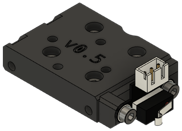
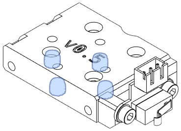
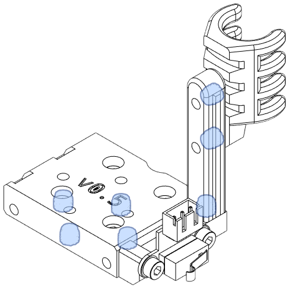
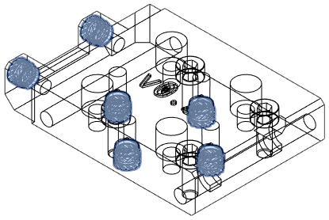
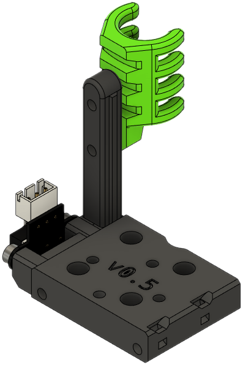
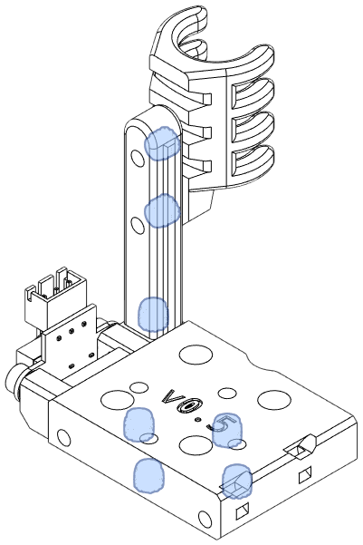

The Top module attaches to the MGN12H carriage and mounts the X axis endstop. The default version has the X endstop on the right side. There is a left-handed version for homing to the left. Both left- and right-handed versions are available with and without a built-in anchor for a cable guide.

!!! tip
    Don't forget to grab the [X Axis Stop Block](other.md#x-axis-stop-block)!

### Right-Handed Top with Endstop

**Description**

A Top for PCB mount users without a cable guide. See [Toolhead PCB Mount](#toolhead-pcb-mount).

[**Revision:**](#revision-history) v0.2

**Bill of Materials**

| Parts     | Qty |
|-----------|-----|
| [:material-printer-3d-nozzle: `top_endstop_right_pcb.stl`][top_pcb] | 1 |
| [:material-cart: Horizontal limit switch][bom_limit_switch]  | 1 |
| M3-0.5 x 8mm SHCS         | 6 |
| Heat Set Insert, M3x5x4   | 6 |

{ width=256px}

??? info "Heat Set Insert Locations"
    { width=200px}

### Right-Handed Top with Endstop and Wire Anchor

**Description**

This is a stock EVA Top piece modified for users with umbilicals.

[**Revision:**](#revision-history) v0.2

**Bill of Materials**

| Parts     | Qty |
|-----------|-----|
| [:material-printer-3d-nozzle: `top_endstop_right.stl`][top] | 1 |
| [:material-printer-3d-nozzle: `cable_guide.stl`][cable_guide] | 1 |
| [:material-cart: Horizontal limit switch][bom_limit_switch]  | 1 |
| M3-0.5 x 6mm SHCS | 2 |
| M3-0.5 x 8mm SHCS | 6 |
| Heat Set Insert, M3x5x4  | 6 |

{ width=256px}

??? info "Heat Set Insert Locations"
    { width=200px}

### Left-Handed Top with Endstop

**Description**

A Top for PCB mount users without a cable guide. See [Toolhead PCB Mount](#toolhead-pcb-mount).

This part has the X endstop on the left side.

[**Revision:**](#revision-history) v0.2

**Bill of Materials**

| Parts     | Qty |
|-----------|-----|
| [:material-printer-3d-nozzle: `top_endstop_left_pcb.stl`][top_left_pcb] | 1 |
| [:material-cart: Horizontal limit switch][bom_limit_switch]  | 1 |
| M3-0.5 x 8mm SHCS         | 6 |
| Heat Set Insert, M3x5x4   | 6 |

{ width=256px}

??? info "Heat Set Insert Locations"
    { width=200px}

### Left-Handed Top with Endstop and Wire Anchor

**Description**

This is a stock EVA Top piece modified for users with umbilicals.

This part has the X endstop on the left side.

[**Revision:**](#revision-history) v0.2

**Bill of Materials**

| Parts     | Qty |
|-----------|-----|
| [:material-printer-3d-nozzle: `top_endstop_left_pcb.stl`][top] | 1 |
| [:material-printer-3d-nozzle: `cable_guide.stl`][cable_guide] | 1 |
| [:material-cart: Horizontal limit switch][bom_limit_switch]  | 1 |
| M3-0.5 x 6mm SHCS | 2 |
| M3-0.5 x 8mm SHCS | 6 |
| Heat Set Insert, M3x5x4  | 6 |

{ width=256px}

??? info "Heat Set Insert Locations"
    { width=200px}

## Revision History

| Date | File | Version | Description |
|------|------|---------|-------------|
| 23/05/03 | `top_endstop_left.stl`         | v0.2 | Added mirrored version of standard. |
| 23/05/03 | `top_endstop_left_pcb.stl`     | v0.2 | Added mirrored version of standard. |
| 23/05/03 | `top_endstop_right.stl`        | v0.2 | Heat set inserts for limit switch; renamed from `top_endstop_mgn12h.stl` |
| 23/05/03 | `top_endstop_right_pcb.stl`    | v0.2 | Heat set inserts for limit switch; renamed from `top_endstop_mgn12h_pcb.stl` |
| 23/03/10 | `top_endstop_mgn12h_pcb.stl`   | v0.1 | Initial tracked release. |
| 23/03/10 | `top_endstop_mgn12h.stl`       | v0.1 | Initial tracked release. |
