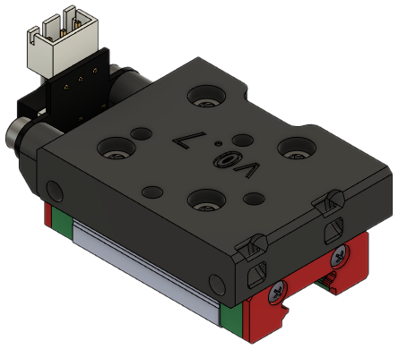
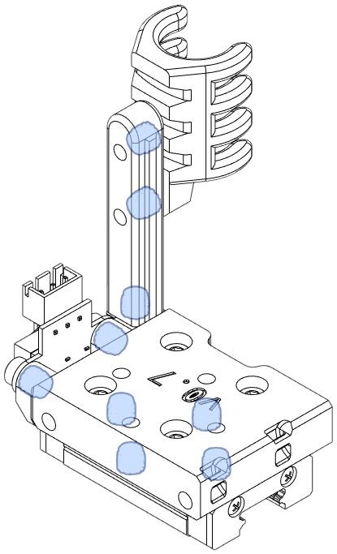
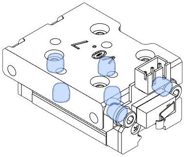
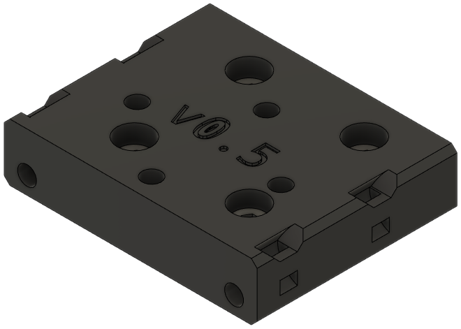
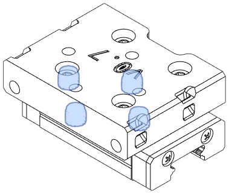

The Top module attaches to the MGN12H carriage and mounts the X axis endstop. The right-handed versions home to the right, and vice versa for the left. Both left- and right-handed versions are available with and without a built-in anchor for a cable guide.

!!! tip
    Don't forget to grab the [X Axis Stop Block](stop_block.md)!

Available versions of this module:

- [Left-handed](#left-handed)
- [Left-handed with Wire Anchor](#left-handed-with-wire-anchor)
- [Right-handed](#right-handed)
- [Right-handed with Wire Anchor](#right-handed-with-wire-anchor)
- [Sensorless Homing](#sensorless-homing)
- [Integrated Microswitch](#integrated-microswitch)

### Left-Handed

**Description**

A Top for PCB mount users without a cable guide. See [Toolhead PCB Mount](#toolhead-pcb-mount).

This part has the X endstop on the left side.

[**Revision:**](#revision-history) v0.7

**Bill of Materials**

| Parts     | Qty |
|-----------|-----|
| [:material-printer-3d-nozzle: `top_left_endstop.stl`][top_left_endstop] | 1 |
| [:material-cart: Horizontal limit switch][bom_limit_switch]  | 1 |
| M3-0.5 x 6mm SHCS         | 2 |
| M3-0.5 x 8mm SHCS         | 6 |
| Heat Set Insert, M3x5x4   | 6 |
| *Lock washers, M3*        | 4 |

{ width=256px}

??? info "Heat Set Insert Locations"
    { width=200px}

### Left-Handed with Wire Anchor

**Description**

This is a stock EVA Top piece modified for users with umbilicals.

This part has the X endstop on the left side.

[**Revision:**](#revision-history) v0.7

**Bill of Materials**

| Parts     | Qty |
|-----------|-----|
| [:material-printer-3d-nozzle: `top_left_endstop_anchor.stl`][top_left_endstop_anchor] | 1 |
| [:material-printer-3d-nozzle: `cable_anchor.stl`][cable_anchor] | 1 |
| [:material-printer-3d-nozzle: `cable_guide.stl`][cable_guide] | 1 |
| [:material-cart: Horizontal limit switch][bom_limit_switch]  | 1 |
| M3-0.5 x 6mm SHCS | 4 |
| M3-0.5 x 8mm SHCS | 5 |
| Heat Set Insert, M3x5x4  | 7 |
| *Lock washers, M3*       | 7 |

{ width=256px}

??? info "Heat Set Insert Locations"
    { width=200px}

### Right-Handed

**Description**

A Top for PCB mount users without a cable guide. See [Toolhead PCB Mount](#toolhead-pcb-mount).

[**Revision:**](#revision-history) v0.7

**Bill of Materials**

| Parts     | Qty |
|-----------|-----|
| [:material-printer-3d-nozzle: `top_right_endstop.stl`][top_right_endstop] | 1 |
| [:material-cart: Horizontal limit switch][bom_limit_switch]  | 1 |
| M3-0.5 x 6mm SHCS         | 2 |
| M3-0.5 x 8mm SHCS         | 6 |
| Heat Set Insert, M3x5x4   | 6 |
| *Lock washers, M3*        | 4 |

{ width=256px}

??? info "Heat Set Insert Locations"
    { width=200px}

### Right-Handed with Wire Anchor

**Description**

This is a stock EVA Top piece modified for users with umbilicals.

[**Revision:**](#revision-history) v0.7

**Bill of Materials**

| Parts     | Qty |
|-----------|-----|
| [:material-printer-3d-nozzle: `top_right_endstop_anchor.stl`][top_right_endstop_anchor] | 1 |
| [:material-printer-3d-nozzle: `cable_anchor.stl`][cable_anchor] | 1 |
| [:material-printer-3d-nozzle: `cable_guide.stl`][cable_guide] | 1 |
| [:material-cart: Horizontal limit switch][bom_limit_switch]  | 1 |
| M3-0.5 x 6mm SHCS | 4 |
| M3-0.5 x 8mm SHCS | 5 |
| Heat Set Insert, M3x5x4  | 7 |
| *Lock washers, M3*       | 7 |

{ width=256px}

??? info "Heat Set Insert Locations"
    { width=200px}

### Sensorless Homing

**Description**

This top piece is specifically for users with sensorless homing.

Note that this does not have an anchor for an umbilical.

[**Revision:**](#revision-history) v0.7

**Bill of Materials**

| Parts     | Qty |
|-----------|-----|
| [:material-printer-3d-nozzle: `top_no_endstop.stl`][top_no_endstop] | 1 |
| M3-0.5 x 8mm SHCS | 5 |
| Heat Set Insert, M3x5x4  | 4 |
| *Lock washers, M3*       | 4 |

{ width=256px}

??? info "Heat Set Insert Locations"
    { width=200px}

### Integrated Microswitch

There are two known mods for using a simple microswitch (e.g. Omron D2F-L):

- [Top MGN12H with Inbuilt Limit](https://www.printables.com/model/555302-zero-g-mercury-e34m1-top-mgn12h-with-inbuilt-limit) by [syph3rd](https://www.printables.com/@syph3rd_963296)
- [Top MGN12H with Integrated Limit Switch (remix)](https://www.printables.com/model/658976-zero-g-mercury-e34m1-top-mgn12h-with-integrated-li) by [Christopher Heinlein](https://www.printables.com/@ChristopherHe_488911)

### Revision History

| Date | File | Version | Description |
|------|------|---------|-------------|
| 23/11/02 | `top_left_endstop.stl`         | v0.7 | Redesign; renamed from `top_endstop_left_pcb.stl` |
| 23/11/02 | `top_left_endstop_anchor.stl`  | v0.7 | Redesign; renamed from `top_endstop_left.stl` |
| 23/11/02 | `top_right_endstop.stl`        | v0.7 | Redesign; renamed from `top_endstop_right_pcb.stl` |
| 23/11/02 | `top_right_endstop_anchor.stl` | v0.7 | Redesign; renamed from `top_endstop_right.stl` |
| 23/11/02 | `top_no_endstop.stl`           | v0.7 | Redesign |
| 23/10/22 | `top_no_endstop.stl`           | v0.5 | Added senorless homing top based on v0.5. |
| 23/05/03 | `top_endstop_left.stl`         | v0.5 | Added cable anchor. |
| 23/05/03 | `top_endstop_left_pcb.stl`     | v0.5 | Version bump to match. |
| 23/05/03 | `top_endstop_right.stl`        | v0.5 | Added cable anchor. |
| 23/05/03 | `top_endstop_right_pcb.stl`    | v0.5 | Version bump to match |
| 23/05/03 | `top_endstop_left.stl`         | v0.3 | Improved zip tie anchors. |
| 23/05/03 | `top_endstop_left_pcb.stl`     | v0.3 | Improved zip tie anchors. |
| 23/05/03 | `top_endstop_right.stl`        | v0.3 | Improved zip tie anchors. |
| 23/05/03 | `top_endstop_right_pcb.stl`    | v0.3 | Improved zip tie anchors. |
| 23/05/03 | `top_endstop_left.stl`         | v0.2 | Added mirrored version of standard. |
| 23/05/03 | `top_endstop_left_pcb.stl`     | v0.2 | Added mirrored version of standard. |
| 23/05/03 | `top_endstop_right.stl`        | v0.2 | Heat set inserts for limit switch; renamed from `top_endstop_mgn12h.stl` |
| 23/05/03 | `top_endstop_right_pcb.stl`    | v0.2 | Heat set inserts for limit switch; renamed from `top_endstop_mgn12h_pcb.stl` |
| 23/03/10 | `top_endstop_mgn12h_pcb.stl`   | v0.1 | Initial tracked release. |
| 23/03/10 | `top_endstop_mgn12h.stl`       | v0.1 | Initial tracked release. |
