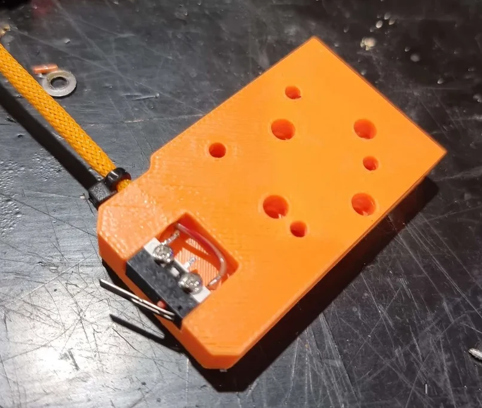
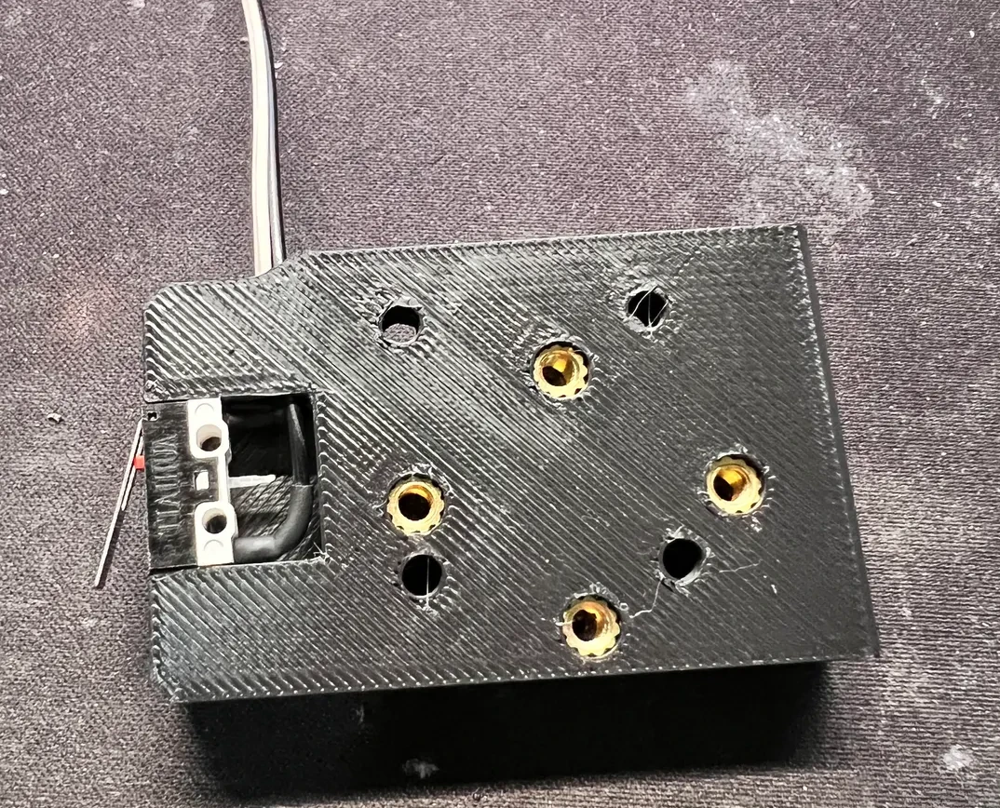





The Top module attaches to the MGN12H carriage and mounts the X axis endstop. The right-handed versions home to the right, and vice versa for the left. Both left- and right-handed versions are available with and without a built-in anchor for a cable guide.

!!! tip
    Don't forget to grab the [X Axis Stop Block](stop_block.md)!


{{ format.comp_entry(comp, prefix=prefix, img_width="200px") }}



### Integrated Microswitch

There are two known Top mods that use a simple microswitch (e.g. Omron D2F-L).

[Top MGN12H with Inbuilt Limit](https://www.printables.com/model/555302-zero-g-mercury-e34m1-top-mgn12h-with-inbuilt-limit) by [syph3rd](https://www.printables.com/@syph3rd_963296)

 by [Christopher Heinlein](https://www.printables.com/@ChristopherHe_488911)

[Top MGN12H with Integrated Limit Switch (remix)](https://www.printables.com/model/658976-zero-g-mercury-e34m1-top-mgn12h-with-integrated-li) by [Christopher Heinlein](https://www.printables.com/@ChristopherHe_488911)

