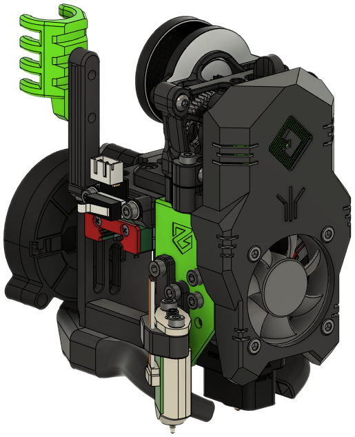
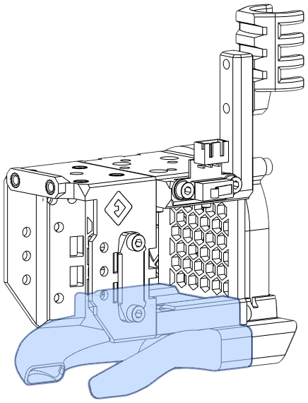
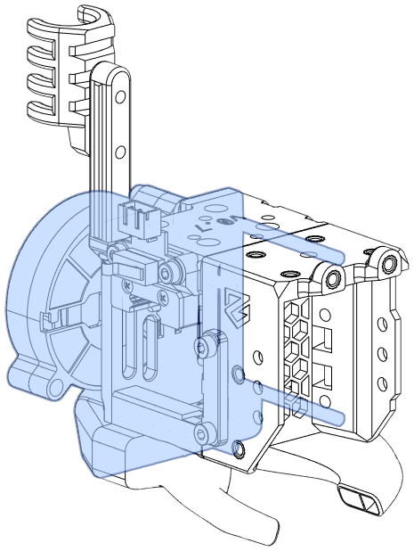
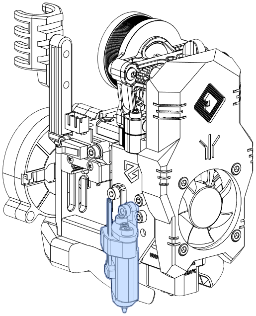
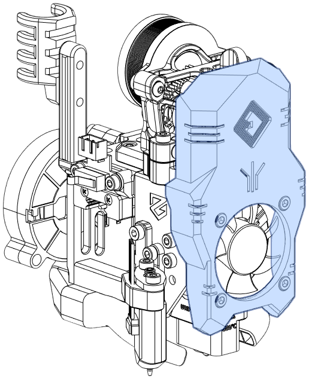

## Overview

E34M1 replaces many of the printed parts from EVA 3, while maintaining compatibility with others. This tour introduces the E34M1 *and* everything else you need to print from EVA 3.

### Core E34M1 Assembly
<figure markdown>
{width="300px"}
</figure>

### Complete Assembly
<figure markdown>
{width="300px"}
</figure>

## E34M1 Core Modules

These are all components specific to E34M1.

### Front

Numerous parts, including the hotend and belts, attach to the front piece.

<figure markdown>
{width="300px"}

[Bill of Materials](bom.md#universal-front){.md-button}

[Heat Set Inserts](inserts.md#universal-front){.md-button}
</figure>

### Top

The top mounts the MGN12H carriage, the X axis endstop, and an optional cable guide. A version is available without the cable guide for toolhead PCB users.

<figure markdown>
{width="300px"}

[Bill of Materials](bom.md#top-with-endstop){.md-button}

[Heat Set Inserts](inserts.md#top-with-endstop){.md-button}
</figure>

### Bottom

The bottom horns are primarily for part cooling. Some ABL methods (e.g., Beacon, Klicky) mount here.

<figure markdown>
{width="300px"}

[Bill of Materials](bom.md#bottom-horns){.md-button}

[Heat Set Inserts](inserts.md#bottom-horns){.md-button}
</figure>

### Rear Cooling Inlet

Stock EVA has a rear piece in this location that acts as a belt tensioner. It is removed in E34M1, with the cooling inlet moved forward and serving in its place.

<figure markdown>
{width="300px"}

[Bill of Materials](bom.md#rear-cooling-inlet){.md-button}

[Heat Set Inserts](inserts.md#rear-cooling-inlet){.md-button}
</figure>

### ABL Mount

The side ABL mount is modified from stock EVA.

!!! note
    Not all ABL methods use the ABL mount (e.g., Klicky, Beacon).

<figure markdown>
{width="300px"}

[Bill of Materials](bom.md#abl){.md-button}

[Heat Set Inserts](inserts.md#abl){.md-button}
</figure>

## Stock EVA Modules

These components have not changed from EVA. As such, you will need to download the correct parts from the [EVA](https://main.eva-3d.page/) site (or elsewhere such as on [Printables](https://printables.com)).

### Hotend

This mounts the hotend, cooling fan, and optional shroud.

<figure markdown>
{width="300px"}

[Stock EVA 3 Hotends](https://main.eva-3d.page/heat_insert/hotend/bmo/){.md-button}
</figure>

### Drive

The drive module attaches the extruder and extruder stepper to the toolhead.

!!! note 
    Mounting the Drive (extruder and stepper) assembly normally uses seven (7) M3-0.5 x 8mm SHCS. You will need to substitute three (3) of these screws for M3-0.5 x 12mm SHCS.

<figure markdown>
{width="300px"}

[Stock EVA 3 Drive Modules](https://main.eva-3d.page/heat_insert/drive/bmg/){.md-button}
</figure>

### Shroud

All stock shrouds are compatible with E34M1.

<figure markdown>
{width="300px"}

[Stock EVA 3 Shrouds](https://main.eva-3d.page/heat_insert/shrouds/chonkier/){.md-button}
</figure>

## Other E34M1 Components

E34M1 provides several other components that may be useful:

| Component                     | Purpose |
|-------------------------------|---------|
| [Front Intake Duct](bom.md#front-intake-duct) | Allows hotend cooling fans to be removed with two (2) screws. |
| [X Axis Stop Block](bom.md#x-axis-stop-block) | Bumper for the X axis endstop, adapted from M1.1. |
| [Z Limit Switch Mount](bom.md#z-end-stop-mount) | Covers the Z endstop PCB. |
| [Toolhead PCB Mounts](bom.md#toolhead-pcb-mount) | Mounts for '36 and '42 PCBs for NEMA17 steppers. |
| [Toolhead PCB Shrouds](bom.md#toolhead-pcb-shroud) | Shrouds to cover toolhead PCB wiring. |

## Related and Contributed Mods

These are user mods that add compatibility or new features to EVA 3.

| Mod Name | Author | Purpose |
|----------|--------|---------|
| [Klicky Probe Dock for Mercury 1 Zero G](https://www.printables.com/model/386819-klicky-probe-dock-for-mercury-1-zero-g) | [Sir_Wash](https://www.printables.com/social/415185-sir_wash) | Adds a dock for Klicky; works with `bottom_horns_klicky_fi.stl`. |
| [Beacon Volcano Duct](https://www.printables.com/model/428524-eva30-phaetus-rapido-uhfvolcano-beacon-for-mercury) | [Psych0h3ad](https://www.printables.com/social/168275-psych0h3ad/about) | Add support for Beacon ABL for Volcano-length hotends. |
| [EVA 3 Beltless backplate for dual 5015](https://www.printables.com/model/430281-eva-3-beltless-backplate-for-dual-5015) | [Psych0h3ad](https://www.printables.com/social/168275-psych0h3ad/about) | Allows any stock rear intake to be used with E34M1. |
| [E34M1/EVA 3 Lightweight Back Piece ](https://www.printables.com/model/431146-e34m1eva-3-lightweight-back-piece) | [jonspaceharper](https://www.printables.com/social/511131-jonspaceharper/about) | Allows any stock rear intake to be used with E34M1. Lightweight remix of the above. |
| [E34M1/EVA 3 Dragon Hotend Mount](https://www.printables.com/model/436000-e34m1eva-3-dragon-hotend-mount) | [jonspaceharper](https://www.printables.com/social/511131-jonspaceharper/about) | Supports Dragon BMO hotends.

