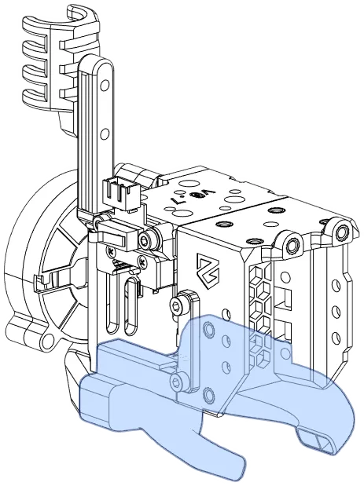
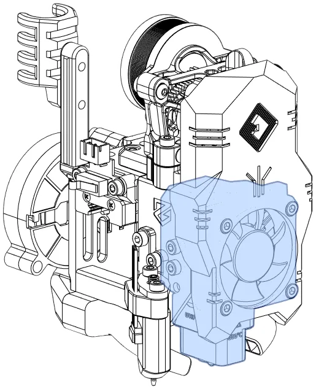
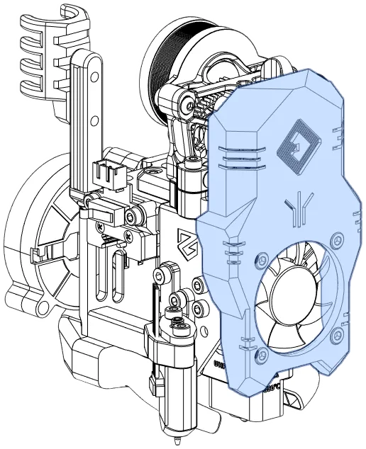

## Overview

Hotends, extruders, and most shrouds are compatible between EVA 3 and E34M1, but the core components of the toolhead are different. This tour introduces E34M1 and the larger EVA 3 ecosystem.

**Core E34M1 Assembly**
<figure markdown>
{width="300px"}
</figure>

**Complete Assembly**
<figure markdown>
{width="300px"}
</figure>

## Core Modules

Core modules are specific to E34M1. Each module comes in several variations.

### [Front](modules/front.md)

The Front mounts the hotend, belts, the front of the Drive module, and optionally, an ABL method and/or accelerometer.

<figure markdown>
[{width="300px"}](modules/front.md)
</figure>

### [Top](modules/top.md)

The top mounts the MGN12H carriage, the X endstop, and the back of the Drive module. Some Top modules have a cable guide attachment point.

<figure markdown>
[{width="300px"}](modules/top.md)
</figure>

### [Bottom Horns](modules/bottom.md)

The bottom horns form the lower joint between the Front and Rear Inlet; the horns direct part cooling air to the hotend nozzle. Some ABL methods (e.g., Beacon, Klicky) mount on the Bottom Horns.

<figure markdown>
[{width="300px"}](modules/bottom.md)
</figure>

### [Rear Inlet](modules/rear.md)

E34M1's rear body is much smaller than EVA3, and serves as a cooling fan inlet/mount.

<figure markdown>
[{width="300px"}](modules/rear.md)
</figure>

### [ABL Side Mounts](modules/abl.md)

Some ABL methods mount here (e.g., BLTouch and CR Touch); this configuration is not compatible with EVA 3 ABL mounts.

<figure markdown>
[{width="300px"}](modules/abl.md)
</figure>

## EVA-Compatible Modules

These modules are drop-in compatible with EVA 3.

### [Hotends](modules/hotend.md)

The Hotend module mounts the hotend, cooling fan, and an optional shroud.

<figure markdown>
[{width="300px"}](modules/hotend.md)
</figure>

### [Drives/Extruders](modules/drive.md)

The drive module attaches the extruder to the toolhead.

<figure markdown>
[{width="300px"}](modules/drive.md)
</figure>

### Shrouds

All stock EVA 3 shrouds are compatible with E34M1.

<figure markdown>
{width="300px"}
</figure>
- [Stock EVA 3 Shrouds](https://main.eva-3d.page/heat_insert/shrouds/chonkier/)
- [cuiviemen's Chonky Shrouds with LED Lighting](https://www.printables.com/model/420929-eva-30-chonky-shrouds-with-led-lighting)

## Other Components

E34M1 provides several other components that may be useful:

- [X Axis Stop Blocks](modules/stop_block.md): Bumpers for the X axis endstop.
- [NEMA17 PCB Mounts](modules/pcb_mounts.md): (Deprecated) NEMA17 steppers mounts for toolhead PCBs and shrouds to cover them.
- [Optional/Build-Specific](modules/other.md): Filament sensors, Klicky Docks, and other links.
